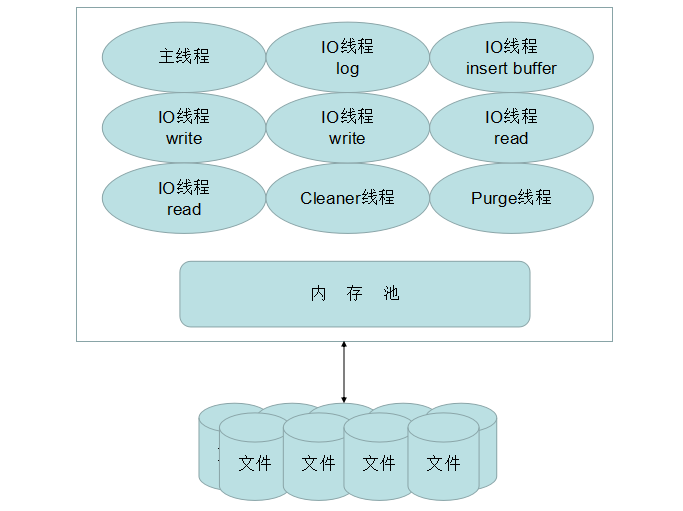
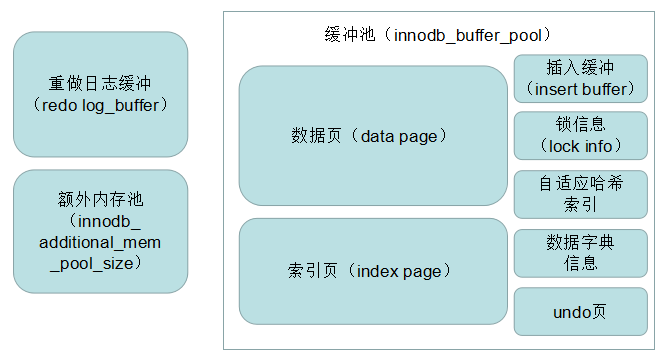
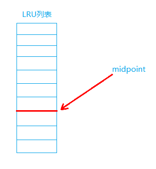
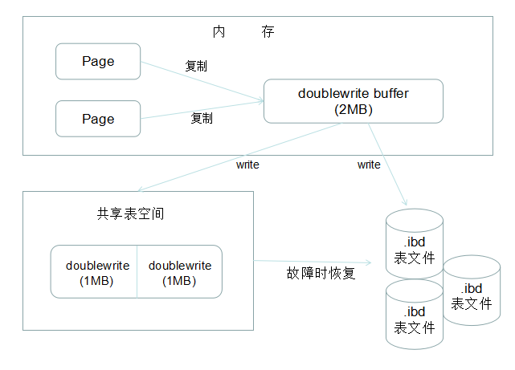

InnoDB存储引擎具有行锁设计、支持事务、支持外键、支持MVCC、支持插入缓冲、支持自适应哈希索引等特点，其整体体系架构主要由后台线程、内存池、文件系统三部分组成，如下图所示：



接下来会针对后台线程和内存池展开介绍。

## 内存池

内存池从大的方面可以分为三块：重做日志缓冲（redo log buffer）、缓冲池（buffer pool）、额外内存池（additional memery pool）。缓冲池中缓存的数据页类型有：数据页（data page），索引页（index page）、插入缓冲（insert buffer）、锁信息（lock info）、自适应哈希索引（adaptive hash index）、数据字典（data dictionary）、undo页等。缓冲池从1.0.X版本开始，允许有多个实例，根据哈希值将每个页平均分配到不同的实例中。



### 1. 缓冲池

Innodb是基于磁盘存储的数据库，CPU速度和磁盘速度之间存在巨大的鸿沟，磁盘速度较慢严重降低了数据库系统的性能。基于这个问题，数据库在内存中开辟了一块区域作为缓冲池来弥补两者之间的速度差距。在数据库中读取页时，首先将从磁盘读到的页放在缓冲池中，下次再读相同的页时，首先判断该页是否在缓冲池中，若命中则直接读取该页，否则从磁盘上读取。

#### LRU列表

缓冲池通过LRU（Latest Recent Used，最近使用）算法来进行管理页（数据页、索引页），最频繁使用的排在`LRU列表`前端，反之，排在末端。当缓冲池不能存放新读取到的页时，首先释放`LRU列表`末端的页。

Innodb在LRU算法上做了一些调整。一些的一次性读取大量页的SQL操作会将缓冲池中的页大量刷出，从而影响缓冲池的效率（页缓冲池缓存频繁使用页的初衷不符）。为了解决这个问题，Innodb在LRU算法上引入了midpoint概念，midpoint点将`LRU列表`一分为二，`LRU列表`前端至midpoint点为`new列表`，midpoint点至`LRU列表`末端为`old列表`。`new列表`和`old列表`各自都以LRU算法管理，新读取的页被加入`old列表`，只有在`old列表`中存活一定时间(`innodb_old_blocks_time`)以后才会被加入`new列表`，可以看出`new列表`中的页都是最为活跃的热点数据。midpoint默认值是37%，即默认`old列表`占完整LRU列表的37%，由参数`innodb_old_blocks_pct`控制。



`LRU列表`中存储的页数上限是确定的，Innodb引入了`Free列表`来与`LRU列表`共同管理，未分配的页由`Free列表`进行管理，`Free列表`当前页数加`LRU列表`当前页数等于`LRU列表`可容纳的总页数。新读取页时，首先从`Free列表`中查找是否有空闲页，若有则将空闲页从`Free列表`移到`LRU列表`中，否则根据规则淘汰`LRU列表`末尾的页。

InnoDB中页的大小是16KB，InnoDB从1.0.X开始，支持压缩页功能，可以将部分页压缩为1KB、2KB、4KB、8KB，对于非16KB的页，使用`unzip_LRU列表`管理。如需要申请4KB大小的页时，通过伙伴算法进行分配，过程如下：

1. 检查4KB的`unzip_LRU列表`，检查是否有可用空闲页，若有则直接使用
2. 检查8KB的`unzip_LRU列表`，若有空闲页，将页分成2个4KB页，存放到4KB的`unzip_LRU列表`
3. 从`LRU列表`申请一个16KB的页，将页分成1个8KB的页和2个4KB的页，分别存放到对应的`unzip_LRU列表`中

#### 脏页

`LRU列表`中的页被修改后，该页称为脏页（dirty page），脏页既存在于`LRU列表`中又存在于`Flush列表`中，会通过`CheckPoint机制`被刷新会磁盘。

#### 插入缓冲

**插入缓冲主要是针对，插入操作时在非唯一的非聚集索引上进行离散插入会导致性能下降，这个问题设计的**。对于聚集索引，与数据的物理存储顺序是一致的，不用担心性能问题，但对于B+树结构下的非聚集索引这是需要考虑的问题。

这里需要注意的两点是：

1. 插入缓冲针对的是非聚集索引，不要因为名字就认为针对的是数据页
2. 插入缓冲管辖的非聚集索引必须是非唯一的索引

InnoDB存储引擎设计了Insert Buffer（插入缓冲），对于非聚集索引的插入或更新操作，不是每一次直接插入到索引页中，而是先判断插入的非聚集索引页是否在缓冲池中，若在则直接插入，否则先放入到Insert Buffer对象中，好似欺骗。之后主线程会异步地进行合并插入缓冲的工作，这样就大大提高了非聚集索引的插入效率。

Insert Buffer的数据结构是一棵B+树，在MySQL4.1之前每张表有一棵B+树，而现在版本中全局只有一棵B+树，这棵B+树存放在共享表空间中，默认也就是`ibdata1文件`中。因此，试图通过独立表空间`.ibd文件`恢复表中数据时，往往会导致CHECK TABLE失败。这是因为表的辅助索引中的数据可能还在Insert Buffer中，所以通过`.ibd文件`进行恢复后，还需要进行REPAIR TABLE操作来重建表上所有的辅助索引。

**B+树数据结构**

Insert Buffer B+树非叶子节点存放的是查询的search key，其结构如下所示：space占用4字节，表示插入的表空间的id（InnoDB中每个表都有一个唯一的space id）；marker占用1字节，用于兼容老版本Insert Buffer；page_no占用4字节，表示页所在的偏移量


Insert Buffer B+树叶子节点的记录，结构如下图所示


space、marker、page_no字段和非叶子节点中的含义相同，一共9个字节，metadata字段占用4个字节，存储内容如下

|   名称   |  字节  |
| :-----: | :----: |
| IBUF_REC_OFFSET_COUNT| 2 |
| IBUF_REC_OFFSET_TYPE | 1 |
| IBUF_REC_OFFSET_FLAGS| 1 |

IBUF_REC_OFFSET_COUNT用来排序每个记录进入Insert Buffer的顺序，因为Innodb从1.0.X开始支持Change Buffer，所以需要这个顺序回放才能得到记录的正确值。

> 注：
>
> 1. IBUF_REC_OFFSET_TYPE和IBUF_REC_OFFSET_FLAGS暂时我也没理解清楚，可能与，后面的索引页类型有关
> 2. 接下来关于Insert Buffer Bitmap这一块，我也没懂，仅做知识点记录，以后弄明白了再补充

启用Insert Buffer索引后，辅助索引页(space, page_no)中的记录可能被插入到B+树中，为了保证每次Merge Insert Buffer页必须成功，还需要一个特殊的页用来标记每个辅助索引页的可用空间，这个页的类型是Insert Buffer Bitmap。

每个Insert Buffer Bitmap页用来追踪16384个辅助索引页，即256个区（Extent）（所以一个区是64个页，一个区1MB ）。每个Insert Buffer Bitmap页都在16384个页的第二个页中。每个辅助索引页在Insert Buffer Bitmap页中占用4位(bit)，如下所示：

| 名称             | 大小(bit) | 说明                                                         |
| ---------------- | --------- | ------------------------------------------------------------ |
| IBUF_BITMAP_FREE | 2         | 0 -> 无可用剩余空间<br />1 -> 剩余空间大于1/32页(512字节)<br />2 -> 剩余空间大于1/16页<br />3 -> 剩余空间大于1/8页 |
| IBUF_BITMAP_BUFFERED | 1 |1表示辅助索引页有记录被缓存在Insert Buffer B+树中|
| IBUF_BITMAP_IBUF | 1 |1表示该页位Insert Buffer B+树的索引页|
>注：总结有以下几个没弄明白的点：
>1.在硬盘上，辅助索引是如何划分页的，如何存储，随着数据的随机新增页的划分不会发生大范围的变化吗
>2.Insert Buffer B+树叶子节点中的记录具体结构什么样（是单个索引记录还是整页记录）
>3.Insert Buffer Bitmap在Insert Buffer B+树上吗，如何存在，它追踪16384个页数量的原因

#### Change Buffer

Change Buffer是InnoDB从1.0.X版本起引入的，可视为Insert Buffer的升级，可以对DML操作——INSERT、DELETE、UPDATE——都进行缓冲，分别是：Insert Buffer、Delete Buffer、Purge Buffer。

Update操作分为两个步骤：

1. 将记录标记为已删除——对应Delete Buffer
2. 真正将记录删除——对应Purge Buffer

#### UNDO页

为了满足事务的原子性，在操作任何数据之前，首先将数据备份到一个地方（这个存储备份的地方称为Undo Log），然后进行数据的修改，这样在rollback时，可以利用Undo Log中备份的undo页将数据恢复到事务开始之前的状态。

#### 自适应哈希索引

InnoDB存储引擎会监控对表上各索引页的查询。如果观察到建立哈希索引可以带来速度提升，则建立哈希索引，称之为自适应哈希索引（Adaptive Hash Index, AHI）。AHI是通过缓冲池的B+数页构造而来的，因此建立速度很快，而且不需要对整张表构建哈希索引。InnoDB存储引擎会自动根据访问的频率和模式来自动地为某些热点页建立哈希索引。

AHI有一个要求，即对这个页的连续访问模式必须是一样的。例如对于（a，b）这样的联合索引，其访问模式可以是以下情况：

```sql
WHERE a=xxx
WHERE a=xxx AND b=xxxx
```

若交替进行上述两种查询，那么不会对该页构造AHI。另外，还有如下要求：

1. 以该模式访问了100次
2. 页通过该模式访问了N次，其中N=页中记录/16

正如一般所知的哈希索引，自适应哈希索引也只能进行等值查询，范围查询是不能使用哈希索引的。

默认自适应哈希索引是开启的，可以通过`innodb_adaptive_hash_index`来配置禁用或启动此特性。

### 2. 重做日志缓冲

重做日志是InnoDB引擎对其本身事务操作的日志记录，记录了关于每个页的更改的物理情况。重做日志的存在能够避免宕机造成数据的丢失。

在InnoDB中，为了协调CPU与磁盘速度的鸿沟，页的操作首先都是在缓冲池中完成的。重做日志也一样，InnoDB引擎首先将重做日志信息放入到内存中（即重做日志缓冲），然后按一定频率将其刷新到重做日志文件。重做日志缓冲一般不需要设置太大，因为一般情况下每一秒中会将其刷新到重做日志文件，因此只需要保证每秒产生的事务量在这个缓冲大小之内即可（可通过`innodb_log_buffer_size`控制其大小，默认8MB）。重做日志文件会在三种情况下刷新到重做日志文件：

1. 主线程每秒刷新一次
2. 每个事务提交时，会将重做日志缓冲刷新到重做日志文件
3. 当重做日志缓冲池剩余空间小于1/2时刷新

当前事务数据库系统普遍采用Write Ahead Log策略，即当事务提交时，先写重做日志，再对页数据进行修改。因此当发生宕机而导致数据丢失时，可通过重做日志完成数据的恢复，当然未刷新到日志文件的重做日志（1秒以内）还是会有所丢失。

**为什么需要重做日志**

如果没有重做日志存在，将数据页刷新到硬盘都将直接操作数据文件，当从缓冲池将页的新版本刷新到硬盘时发生宕机，可能出现部分已写入部分未写入的情况，因为没有重做日志的存在，无法定位哪些页未写入。

> 注意：重做日志文件的主要作用不是避免宕机造成的数据丢失，而是避免因宕机造成的数据文件的不完整。数据恢复只是不可靠的顺带的功能。BinLog文件才是真正为避免数据丢失而生的。

### 3. 额外内存池

在InnoDB存储引擎中，对内存的管理是通过内存堆的方式进行的。在对数据结构本身的内存进行分配时，需要从额外的内存池中进行申请，当该区域的内存不足时，会从缓冲池中申请。例如，分配了缓冲池，但是每个缓冲池中的帧缓冲还有对应的缓冲控制对象（Buffer Control Block），这些对象记录了一些注入LRU、锁、等待等信息，而这个对象的内存需要从额外内存池中申请。因此，当申请了很大的InnoDB缓冲池时，也应考虑相应地增加这个值。


## 其他技术与特性

### 1. CHECKPOINT技术

CheckPoint（检查点）技术与前面说过的重做日志有密切地关系。重做日志是用于防止因宕机导致数据文件损坏，更改记录被刷新到硬盘后，这部分的日志便已经不再需要了，可以被覆盖。因此重做日志文件被设计成可以循环使用的，一般重做日志文件有两个（也可以设置成超过两个文件），循环使用这两个文件。

要能使用重做日志来恢复数据，必须知道哪些版本数据已经刷入硬盘，哪些版本未刷入硬盘。基于此，就有了检查点（CheckPoint）技术。对于InnnoDB存储引擎而言，其是通过LSN（Log Sequence Number）来标记版本的，LSN是8字节地数字，其单位是字节。每个页有LSN，重做日志中也有LSN，CheckPoint也有LSN，CheckPoint前的数据都已经被刷入硬盘，通过比对CheckPoint的LSN和重做日志中的LSN便能知道哪些版本数据未刷入硬盘。

在InnoDB中，CheckPoint发生的时间、条件、脏页的选择、刷新脏页的数量都非常复杂。CheckPoint的发生主要有以下几种：

1. 数据库关闭时，将所有的脏页都刷回硬盘，这是默认都有的（`innodb_fast_shutdown=1`）
2. 主线程每1秒、每10秒从缓冲池的列表中刷新一定比例的页回磁盘，这个过程是异步的
3. InnoDB引擎需要保证LRU列表中有差不多100个空闲页可供使用，Cleaner线程会检测，如果没有则会将LRU列表尾端的页移除，如果这些页中有脏页（在`Flush列表`中），则会进行CheckPoint。（InnoDB1.2.X开始LRU可用页的数量默认值为1024，且可通过`innodb_lru_scan_depth`控制）
4. 当重做日志文件达到`75% * total_redo_log_file_size`时（`total_redo_log_file_size`是所有重做日志文件的总大小），会执行阻塞发现问题的用户查询线程执行Async Flush CheckPoint；当重做日志文件达到`90% * total_redo_log_file_size`时，会阻塞所有用户查询线程执行Sync Flush CheckPoint。从InnoDB1.2.X开始，在Cleaner线程执行，不会阻塞用户查询线程
5. 当缓冲池中脏页数量达到`innodb_max_dirty_page_pct`（默认75%）时，强制执行CheckPoint

### 2. 刷新临接页

InnoDB还存在了刷新临接页的特性：当刷新一个脏页时，InnoDB存储引擎会检测该页所在区的所有页，如果是脏页，那么一起刷新。可以由参数`innodb_flush_neighbors`来配置启用或关闭此特性（值0表示关闭）。

### 3. 异步IO

InnoDB采用异步IO（Asynchronous IO, AIO）的方式来处理磁盘操作，AIO的一个优势是可以对多个索引页进行并发扫描，另一个优势是可以进行IO Merge操作，将多个IO合并为一个IO，例如用户需要访问的页（space, page_no）为（8，6)、（8，7）、（8，8），每个页大小16KB，AIO会判断这三个页是连续的，AIO底层会发送一个IO请求，读取48KB的页。

在InnoDB1.1.X之前，AIO实现是通过InnoDB引擎代码模拟实现，从InnoDB1.1.X开始，提供了内核级别的AIO支持，称为Native AIO，因此编译或允许该版本MySQL时需要libaio库的支持。Native AIO需要操作系统提供支持，Windows系统和Linux系统都提供Native AIO支持，而Mac OSX系统则未提供，只能依旧使用原模拟的方式。

可以通过参数`innodb_use_native_aio`来控制启用Native AIO，Linux系统下默认启用（ON）。

### 4. 两次写

当数据库宕机时，可能InnoDB正在写入某个页到表中，而这个页只写了一部分，比如16KB的页，只写了前4KB，之后就发生了宕机，这种情况被称为部分写失效。有经验的DBA也许会想如果发生写失效，可以通过重做日志进行恢复。但实际上并不一定可以修复，页内数据有可能本身发生损坏（这与重做日志记录的内容有关，参考[mysql 为何需要Double Write？有redo log还不够吗？](<https://blog.csdn.net/jolly10/article/details/79791574>)，估计是因为重做日志在页内的记录与最终写入磁盘的并不是完全相同的，还会经过一次与底层结构相关的计算），需要先通过页的副本来还原页，再进行重做，这个副本就就是doublewrite的内容。

doublewrite由两部分组成，一部分是内存中的doublewrite buffer，大小为2MB，另一部分是物理磁盘上共享表空间中的连续的2个区（128个页，也是2MB）。在对缓冲区进行刷新时，并不直接写磁盘，而是会通过memcpy函数将页先复制到内存中的doublewrite buffer，之后通过doublewrite  buffer再分两次，每次1MB顺序地写入共享表空间的物理磁盘上，然后马上调用fsync函数，同步磁盘，避免缓冲带来的问题。由于doublewrite页是连续的，因此这个过程是顺序写的，开销并不是很大。在完成doublewrite页写入后，再将doublewrie buffer中的页写入各个表空间文件中，此时写入是离散的。

参数`skip_innodb_doublewrite`可以禁止使用doublewrite功能，有些情况下，这是需要的，如：用户有多个从服务器（在从服务器上做的是RAID0），可以在从服务器上关闭doublewrite功能；有些文件系统（ZFS文件系统）本身提供了部分写失效的防范机制，就不用开启doublewrite功能。



## 后台线程

### 1. Master线程

负责将重做日志缓冲刷新到重做日志文件

### 2. IO线程

Async IO，分为4种线程

1. Read线程（默认4条线程，由`innodb_read_io_thread`参数控制）
2. Write线程（默认4条线程，由`innodb_write_io_thread`参数控制）
3. Insert Buffer线程（1条线程）
4. Log线程（1条线程）

### 3. Purge线程

支持设置多个线程，由`innodb_purge_threads`控制

负责任务UNDO页回收，`innodb_purge_batch_size`控制每次回收数量

### 4. Cleaner线程

负责将缓冲池中的脏页刷新到磁盘