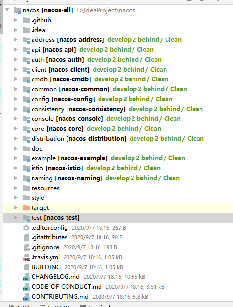

# Nacos

## 源码安装

```
git clone https://github.com/alibaba/nacos.git
cd nacos/
mvn -Prelease-nacos -Dmaven.test.skip=true clean install -U  
```

克隆项目下来后，目录如下所示



依照官方文档介绍，Linux/Unix/Mac启动方式是

```
ls -al distribution/target/

// change the $version to your actual path
cd distribution/target/nacos-server-$version/nacos/bin
sh startup.sh -m standalone
```

windows启动方式，同样进入`target/nacos-server-$version/nacos/bin`目录，双击`startup.cmd`文件运行，或者命令行`cmd startup.cmd`

这里，windows方式遗漏了一些说明，在启动前需要这些配置

1. 双击运行会使用非standalone方式运行，就需要外部的数据库。进入`target/nacos-server-$version/nacos/conf`目录，将`nacos-mysql.sql`导入mysql数据库中（如果是Oracle数据库使用`schema.sql`）数据库。

2. 配置文件需要一些修改，进入`target/nacos-server-$version/nacos/conf`目录，`application.properties`文件添加几行

   ```
   spring.datasource.platform=mysql
   # 本地没有主备数据库，只有1个
   db.num=1
   db.url.0=jdbc:mysql://127.0.0.1:3306/nacos?characterEncoding=utf8&connectTimeout=1000&socketTimeout=3000&autoReconnect=true&useUnicode=true&useSSL=false&serverTimezone=UTC
   db.user=root
   db.password=123456
   # 没有集群，设置list为0，覆盖默认的配置值
   nacos.core.member.lookup.type=file
   nacos.member.list=
   ```

启动后访问`http://localhost:8848/nacos`，默认用户名密码都是`nacos`

关于distribution项目目录：包含各种用途的打包脚本，不同的用途使用不同的环境变量即可。release-nacos环境打包，包含了config功能和register功能，并携带可视化网页，它实际打包的是console项目。

## 维护

通过web页面可以方便地进行可视化的配置和注册服务的维护。

nacos根据配置文件`nacos.core.member.lookup.type`配置的参数选择从哪里加载集群服务器地址列表，具体逻辑如下

```
1. 如果是standalone模式启动，集群仅包含自身服务器
2. 根据nacos.core.member.lookup.type配置确定加载集群方式
   2.1 如果配置的是file方式，则读取nacos.home或系统user.home文件夹下路径为conf/cluster.conf的文件配置，或者nacos.member.list配置的参数值
   2.2 如果配置的是address-server方式，优先读取系统配置address_server_domain、address_server_port、address_server_url，再尝试从配置文件读取address.server.domain、address.server.port、address.server.url配置值，默认使用jmenv.tbsite.net:8080/nacos/serverlist
   2.3 nacos.core.member.lookup.type配置的值不正确或未配置，则优先尝试file方式，再使用address-server方式
```

启动时，控制台也有打印项目运行时的输出目录，logs目录会输出运行时的日志文件，conf目录会输出集群地址文件，status目录会输出最新的心跳包时间，data目录为数据库文件，即如果是standalone方式启动的，使用的内嵌的数据库的文件地址。