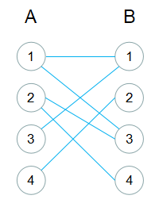
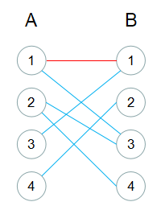
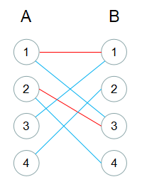
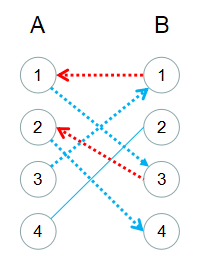
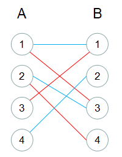
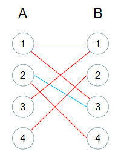

---

title: 从二分图开始到最大匹配
date: 2020-02-23 14:22:00
tags: 图论
permalink: character-set-encoding
keywords: 最小覆盖, 最大匹配，最大独立集
rId: MB-20022301
---

## 图论概念

* 图：由顶点和顶点之间的边组成的集合，表示为G<V, E>，V表示的是顶点的集合，E表示的是边的集合
* 独立集：图内点集的子集，且满足：每两个顶点之间均不存在连边
* 最大独立集：图内顶点数量最多的独立集
* 覆盖：图内点集的子集，且满足：能覆盖（顶点是边的任一个端点都视为覆盖边）图的所有边
* 最小覆盖：图内顶点数量最少的覆盖
* 最小覆盖数：最小覆盖的顶点数量
* 匹配：图内边集的子集，且满足：任意两条边都没有公共顶点
* 最大匹配：图内边数量最多的匹配
* 最大匹配数：最大匹配的边数量

## 二分图

设G<V, E>是一个无向图，如果顶点V可分割为两个互不相交的子集(A, B)，并且图中每条边(i, j)的两个顶点分别属于两个不同的集合(i属于A, j属于B)，则程图G是二分图。

定理和推论：

1. 无向图G是二分图的充要条件是：G至少有两个顶点，且所有环的长度都为偶数
2. 最大独立集顶点数量 = 图中顶点数量 - 最小点覆盖数
3. 最小覆盖数 = 最大匹配数


二分图充要条件证明见[百度百科](<https://baike.baidu.com/item/%E4%BA%8C%E5%88%86%E5%9B%BE/9089095?fr=aladdin#3>)（以`边跨集合A和B，形成环必然需要一次往返的倍数`这个思路考虑）

最大独立集顶点数量证明略（简单思考：去掉最小覆盖点，图中边自然也就不存在了）

### 证明最小覆盖数等于最大匹配数

条件：

```
图G<V,E>
存在点集C是最小点覆盖，最小覆盖数为c
存在边集M是最大匹配，最大匹配数为m
```

求证：m = c

证明：

> 1. 点集C是覆盖，则边集M上的任意一条边，至少有一端点属于C，所以m <= c  （光覆盖这些边就需要m个点）
>
> 2. 点集C是最小覆盖，则有如下两点结论：
>
>    ​    Ⅰ. 点集中每个点都**至少能找到一个**点集外的点与该点连边。如果没有，说明该点所有边端点都在覆盖中，那这个点也没必要包含了，与最小覆盖矛盾
>    ​    Ⅱ. 点集中多个点**都只能**选择同一个点集外的点连边的情况也**不会出现**。如果出现，说明部分点不是必要的，就不是最小覆盖了。
>
>    上面两条保证了每个点都可以有一个覆盖外的点连边且这些连边不包含共同顶点，所以这些连边组成的边集是图G的一个匹配，所以m >= c
>
> 综上两点，m = c 得证

## 寻找最大匹配（匈牙利算法）

交错路径：给定图G的一个匹配M，如果一条路径的边，交替出现在M中和不出现在M中，则称为M-交错路径

增广路径：如果一条M-交错路径，两个端点都不与M中的边关联，则称为M-增广路径


可以使用匈牙利算法查找二分图中的最大匹配，如图所示，点集G<V, E>是一个二分图，可分独立集A和独立集B 



具体算法如下：

1. 
   每次从集合A中取一个未被选取的点，查看该点覆盖的所有边，如果存在一条边的另一端点（位于集合B）也未被选取，则将这两点相连。不断重复该过程，如同所示，第一次选择A1和B1连线，点二次选择A2和B3连线

       

2. 如果A集合中选取的点，覆盖的所有边的另一端点均已被A集合上的点占去（如上图所示，A3覆盖的边A3B1的另一端点B1已经被A1占去），则尝试给占去Bj（该例中为B1）的点Ai（该例中为A1）换一个未被占用的点，如果又被占用，则继续考虑帮占用点换一个点...（这是一个递归过程）。实际上，这就是一个找增广路径的过程，因为要能找到这样的更换路径，在每次给占用点更换连线时，首先要求占用点有其他未连线的边，这样就形成了一个交替——边未匹配过、匹配过、未匹配过、匹配过、未匹配过...（奇数次且两端均是未匹配过）。

   如下图所示，从A3出发，找到了一条路径：A3->B1->A1->B3->A2->B4（已匹配过的边颜色是红色）

   

   找到增广路径之后，将该条线上的红蓝色颜色对调（匹配与未匹配属性反转），就能找到一种总匹配数+1的匹配方式，如下图所示

   

重复1、2步，最终就能找到二分图G的最大匹配



