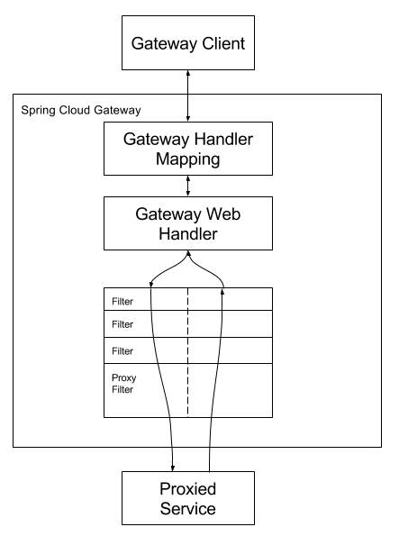

依赖为

```
org.springframework.cloud
spring-cloud-starter-gateway
```

默认启用，若要禁止启用，配置如下参数

```
spring.cloud.gateway.enabled=false
```

**名词**

路由（Route）：是网关的基本构建块。它由ID、目标URI、谓词和过滤器定义。如果谓词判定为true，则匹配该路由。

谓词（Predicate）：这是java 8 定义的Predicat Function。入参是ServerWebExchange，它使你能够匹配http请求的一些情况，例如请求头或请求参数。

过滤器（Filter）：它是由特定工厂（factory）构造的GatewayFilter实例。你能够在下行请求之前或之后，修改请求和响应。

**概述图**



## 配置谓词和过滤器

### 配置方式

有两种方式：快捷方式和完全扩展方式

#### 快捷方式

快捷方式配置由过滤器名称识别，后跟一个等号（=），然后是由逗号分隔的参数值（，）。

application.yml

```yaml
spring:
  cloud:
    gateway:
      routes:
      - id: after_route
        uri: https://example.org
        predicates:
        - Cookie=mycookie,mycookievalue
```

上一个示例使用两个参数定义了Cookie路由谓词工厂，这两个参数是cookie名称，mycookie和与mycookievalue匹配的值。

#### 完全扩展方式

完全扩展的参数看起来更像带有键值对的标准yaml配置。通常有一个`name`键和一个`args`键，`args`键是用于配置谓词或过滤器的键值对映射描述值。

application.yml

```yaml
spring:
  cloud:
    gateway:
      routes:
      - id: after_route
        uri: https://example.org
        predicates:
        - name: Cookie
          args:
            name: mycookie
            regexp: mycookievalue
```

如上所示为前面快捷方式配置的内容，用完全展开方式的配置。


### 谓词工厂

Spring Cloud Gateway包含许多内置的路由谓词工厂，这些谓词匹配不同的HTTP请求属性，你能够将多个路由谓词工厂与逻辑与(`and`)语句结合使用。

#### After路由谓词工厂

`After`路由谓词工厂采用参数`datetime`（Java ZonedDateTime），该谓词匹配在指定时间之后发生的请求。

application.yml

```
spring:
  cloud:
    gateway:
      routes:
      - id: after_route
        uri: https://example.org
        predicates:
        - After=2017-01-20T17:42:47.789-07:00[America/Denver]
```

如上匹配丹佛山区时间2017年1月20日17点42分之后的任何请求。

#### Before路由谓词工厂

 application.yml

```yaml
spring:
  cloud:
    gateway:
      routes:
      - id: before_route
        uri: https://example.org
        predicates:
        - Before=2017-01-20T17:42:47.789-07:00[America/Denver]
```

#### Between路由谓词工厂

application.yml

```yaml
spring:
  cloud:
    gateway:
      routes:
      - id: between_route
        uri: https://example.org
        predicates:
        - Between=2017-01-20T17:42:47.789-07:00[America/Denver], 2017-01-21T17:42:47.789-07:00[America/Denver]
```


#### Cookie路由谓词工厂

`Cookie`路由谓词工厂采用cookie名和Java正则表达式两个参数，分别完全匹配cookie名和正则匹配values。

application.yml

```yaml
spring:
  cloud:
    gateway:
      routes:
      - id: cookie_route
        uri: https://example.org
        predicates:
        - Cookie=chocolate, ch.p
```

上面配置Cookie名为`chocolate`且值匹配表达式`ch.p`。

#### Header路由谓词工厂

类似Cookie路由谓词工厂，需要两个参数，请求头名称`name`和一个正则表达式。

application.yml

```yaml
spring:
  cloud:
    gateway:
      routes:
      - id: header_route
        uri: https://example.org
        predicates:
        - Header=X-Request-Id, \d+
```

#### Host路由谓词工厂

该工厂需要一个参数，有一组主机名匹配串组成的参数，参数还支持uri模板变量格式。该谓词提取URI模板变量作为名称和值的映射，并使用ServerWebExchangeUtils.URI_TEMPLATE_VARIABLES_ATTRIBUTE中定义的键将其放置在ServerWebExchange.getAttributes()中。这些值可供GatewayFilter工厂使用。

application.yml

```yaml
spring:
  cloud:
    gateway:
      routes:
      - id: host_route
        uri: https://example.org
        predicates:
        - Host=**.somehost.org,**.anotherhost.or,{sub}.myhost.org,{sub}.myhost2.org
```

#### Method路由谓词工厂

Method路由谓词工厂，匹配HTTP METHOD，它使用methods参数配置。

application.yml

```yaml
spring:
  cloud:
    gateway:
      routes:
      - id: method_route
        uri: https://example.org
        predicates:
        - Method=GET,POST
```

#### Path路由谓词工厂

Path路由谓词工厂配置，采用两个参数：一组`PathMatcher `模式匹配串和一个可选的名为`matchOptionalTrailingSeparator`的标志。

application.yml

```yaml
spring:
  cloud:
    gateway:
      routes:
      - id: path_route
        uri: https://example.org
        predicates:
        - Path=/red/{segment},/blue/{segment}
```

同样的，使用ServerWebExchangeUtils.URI_TEMPLATE_VARIABLES_ATTRIBUTE中定义的键将其放置在ServerWebExchange.getAttributes()中。可以使用工具类简化这些变量的使用，如下所示：

```
Map<String, String> uriVariables = ServerWebExchangeUtils.getPathPredicateVariables(exchange);

String segment = uriVariables.get("segment");
```

#### Query路由谓词工厂

该工厂配置采用两个参数，`param`和一个可选的基于Java正则表达式的参数。

application.yml

```yaml
spring:
  cloud:
    gateway:
      routes:
      - id: query_route
        uri: https://example.org
        predicates:
        - Query=green
```

上面匹配包含查询参数名为`green`的请求

```
spring:
  cloud:
    gateway:
      routes:
      - id: query_route
        uri: https://example.org
        predicates:
        - Query=red, gree.
```

上面匹配包含查询参数名为`red`且值匹配`gree.`的请求，所以查询参数`green=greet`能够被匹配。

#### RemoteAddr路由谓词工厂

该谓词工厂采用一组至少1个的源列表参数，可以是IPV4字符串也可以是IPV6字符串，例如`192.168.0.1/16`（16表示子网掩码）

application.yml

```yaml
spring:
  cloud:
    gateway:
      routes:
      - id: remoteaddr_route
        uri: https://example.org
        predicates:
        - RemoteAddr=192.168.1.1/24
```

上面的胚子匹配发出请求的客户端的地址，如`192.168.1.10`

#### Weight路由谓词工厂

该路由谓词工厂采用两个参数，字符串类型的组名和数值类型的权值。权值按照组进行计算。

application.yml

```yaml
spring:
  cloud:
    gateway:
      routes:
      - id: weight_high
        uri: https://weighthigh.org
        predicates:
        - Weight=group1, 8
      - id: weight_low
        uri: https://weightlow.org
        predicates:
        - Weight=group1, 2
```

上面的配置中，这条路线将80%的流量转发到weighthigh.org，将20%的流量转发到weightlow.org


有时候，网关位于代理服务器之后，不能获取真实的客户端ip地址。可以设置自定义的`RemoteAddressResolver`来解决这个问题。Spring Cloud Gateway附带了一个非默认远程地址解析器（`XForwardedRemoteAddressResolver`），它是基于`X-Forwarded-For`请求头的。

`XForwardedRemoteAddressResolver`有两个静态构造函数方法。

1. `XForwardedRemoteAddressResolver::trustAll`：返回`RemoteAddressResolver`，这个Resolver总是采用请求头`X-Forwarded-For`里的第一个IP地址。
2. `XForwardedRemoteAddressResolver::maxTrustedIndex`：采用与受信任架构数量相关的索引。例如，如果只能通过HAProxy访问Spring Cloud Gateway，则应使用值1。如果在访问Spring Cloud Gateway之前需要两跳可信基础架构，则应使用值2。


下面例子展示如何使用Java实现相同的配置：

GatewayConfig.java

```java
RemoteAddressResolver resolver = XForwardedRemoteAddressResolver
    .maxTrustedIndex(1);

...

.route("direct-route",
    r -> r.remoteAddr("10.1.1.1", "10.10.1.1/24")
        .uri("https://downstream1")
.route("proxied-route",
    r -> r.remoteAddr(resolver, "10.10.1.1", "10.10.1.1/24")
        .uri("https://downstream2")
)
```


### 过滤器工厂

#### AddRequestHeader过滤器工厂

它采用两个参数。

application.yml

```yaml
spring:
  cloud:
    gateway:
      routes:
      - id: add_request_header_route
        uri: https://example.org
        filters:
        - AddRequestHeader=X-Request-red, blue
```

此配置将`X-Request-red：blue`添加到所有匹配请求的下游请求标头中。它还可以觉查URI变量，如下所示

application.yml

```yaml
spring:
  cloud:
    gateway:
      routes:
      - id: add_request_header_route
        uri: https://example.org
        predicates:
        - Path=/red/{segment}
        filters:
        - AddRequestHeader=X-Request-Red, Blue-{segment}
```

#### AddRequestParameter过滤器工厂

它也是采用两个参数。

application.yml

```yaml
spring:
  cloud:
    gateway:
      routes:
      - id: add_request_parameter_route
        uri: https://example.org
        predicates:
        - Host: {segment}.myhost.org
        filters:
        - AddRequestParameter=foo, bar-{segment}
```

当请求host为s1.myhost.org时，它会将`foo=bar-s1`加入到请求参数。

#### AddResponseHeader过滤器工厂

application.yml

```yaml
spring:
  cloud:
    gateway:
      routes:
      - id: add_response_header_route
        uri: https://example.org
        filters:
        - AddResponseHeader=X-Response-Red, Blue
```

#### DedupResponseHeader过滤器工厂

它采用两个参数：名称列表和策略，名称列表是用空格分隔的请求头名称，策略参数是可选的，允许的参数值为：`RETAIN_FIRST`(默认)、`RETAIN_LAST`、`RETAIN_UNIQUE`。这个过滤器的作用是，移除响应头中重复的值。

application.yml

```yaml
spring:
  cloud:
    gateway:
      routes:
      - id: dedupe_response_header_route
        uri: https://example.org
        filters:
        - DedupeResponseHeader=Access-Control-Allow-Credentials Access-Control-Allow-Origin
```

#### Hystrix过滤器工厂

Hystrix是Netflix实现的断路器，它的作用是保护服务免受级联故障影响，在下游故障的情况下及时断路（简单来说就是不再访问）。要启用断路器，需引入依赖`spring-cloud-starter-netflix-hystrix`。

Hystrix过滤器工厂配置，需要一个名称参数，即HystrixCommand的名称。

application.yml

```yaml
spring:
  cloud:
    gateway:
      routes:
      - id: hystrix_route
        uri: https://example.org
        filters:
        - Hystrix=myCommandName
```

上面配置会将其余的过滤器包装在名称为myCommondName的HystrixCommand中。

Hystrix过滤器还可以接受可选的fallbackUri参数。目前，只支持`forward:`：支持预定方案的uri。如果调用了后备，请求将被转发到与URI匹配的控制器。以下示例配置这样的回退：

application.yml

```yaml
spring:
  cloud:
    gateway:
      routes:
      - id: hystrix_route
        uri: lb://backing-service:8088
        predicates:
        - Path=/consumingserviceendpoint
        filters:
        - name: Hystrix
          args:
            name: fallbackcmd
            fallbackUri: forward:/incaseoffailureusethis
        - RewritePath=/consumingserviceendpoint, /backingserviceendpoint
```

当调用Hystrix后备时，它将转发到/ incaseoffailureusethis URI。请注意，此示例还演示了（可选）Spring Cloud Netflix Ribbon负载平衡（在目标URI上定义了lb前缀）。

主要方案是将fallbackUri用于网关应用程序中的内部控制器或处理程序。但是，您还可以将请求重新路由到外部应用程序中的控制器或处理程序，如下所示：

application.yml

```yaml
spring:
  cloud:
    gateway:
      routes:
      - id: ingredients
        uri: lb://ingredients
        predicates:
        - Path=//ingredients/**
        filters:
        - name: Hystrix
          args:
            name: fetchIngredients
            fallbackUri: forward:/fallback
      - id: ingredients-fallback
        uri: http://localhost:9994
        predicates:
        - Path=/fallback
```

如果将请求转发给后备，则Hystrix网关过滤器还会提供引起该请求的Throwable，它作为ServerWebExchangeUtils.HYSTRIX_EXECUTION_EXCEPTION_ATTR属性添加到ServerWebExchange，您可以在网关应用程序中处理回退时使用该属性。

您可以使用应用程序属性使用全局默认值或逐条路由配置Hystrix设置（例如超时），如Hystrix Wiki上所述。要为前面显示的示例路由设置五秒钟的超时时间，可以使用以下配置：

application.yml

```yaml
hystrix.command.fallbackcmd.execution.isolation.thread.timeoutInMilliseconds: 5000
```

#### CircuitBreaker过滤器工厂

待补充

https://cloud.spring.io/spring-cloud-static/spring-cloud-gateway/2.2.2.RELEASE/reference/html/#spring-cloud-circuitbreaker-filter-factory


## 自定义过滤器工厂与谓词工厂

### 自定义过滤器

#### 全局过滤器

自定义全局过滤器，实现`org.springframework.cloud.gateway.filter.GlobalFilter`和`org.springframework.core.Ordered`接口接口，如下代码所示为全局log过滤器

```
@Slf4j
@Component
public class LogGlobalFilter implements GlobalFilter, Ordered {

    @Override
    public Mono<Void> filter(ServerWebExchange exchange, GatewayFilterChain chain) {

        ServerHttpRequest req = exchange.getRequest();
        URI uri = req.getURI();
        long currentTimeMillis = System.currentTimeMillis();
        Mono<Void> filter = chain.filter(exchange);

        long pass = System.currentTimeMillis() - currentTimeMillis;
        log.debug("path {} completed in {} ms", uri.getRawPath(), pass);
        return filter;
    }

    @Override
    public int getOrder() {
        return Ordered.HIGHEST_PRECEDENCE;
    }
}
```

#### 非全局过滤器

通过继承`org.springframework.cloud.gateway.filter.factory.AbstractGatewayFilterFactory`可实现可配置的非全局过滤器，并且类名需要以`GatewayFilterFactory`结尾，如下所示为权限校验过滤器的实现

```
@Slf4j
@Component
public class AuthorizationGatewayFilterFactory extends AbstractGatewayFilterFactory<AuthorizationGatewayFilterFactory.Config> {


    public static final String EXCLUDE_URLS_KEY = "excludeUrls";

    private final ObjectMapper objectMapper = new ObjectMapper();

    public AuthorizationGatewayFilterFactory() {
        super(Config.class);
    }

    @Override
    public GatewayFilter apply(Config config) {
        return (exchange, chain) -> {
            ServerHttpRequest request = exchange.getRequest();
            URI uri = request.getURI();

            List<String> excludeUrls = config.getExcludeUrls();

            if (isUriExclude(uri, excludeUrls)) {

                return chain.filter(exchange);
            }


            if (!checkAuthorization(request)) {

                log.info("user has not access");

                return errorResponse(exchange.getResponse(), HttpStatus.OK);
            }

            return chain.filter(exchange);
        };
    }

    /**
     * 自定义返回结果
     */
    public Mono<Void> errorResponse(ServerHttpResponse response, HttpStatus httpStatus) {
        response.setStatusCode(httpStatus);
        HttpHeaders httpHeaders = response.getHeaders();
        httpHeaders.add("Content-Type", "application/json; charset=UTF-8");
        httpHeaders.add("Cache-Control", "no-store, no-cache, must-revalidate, max-age=0");

        Result<Object> result = new Result<>();
        result.setCode(IErrorCode.COMMON_ERROR);
        result.setMessage("user has no access");

        byte[] bytes = new byte[0];
        try {
            bytes = objectMapper.writeValueAsBytes(result);
        } catch (JsonProcessingException e) {
            log.error(e.getMessage(), e);
        }
        DataBuffer bodyDataBuffer = response.bufferFactory().wrap(bytes);
        return response.writeWith(Mono.just(bodyDataBuffer));
    }

    private boolean checkAuthorization(ServerHttpRequest request) {

        // TODO 校验权限
        if (Math.random() > 0.9) { // 模拟权限校验失败情况
            return false;
        }

        return true;
    }

    private boolean isUriExclude(URI uri, List<String> excludeUrls) {
        for (String excludeUrl : excludeUrls) { 
            if (StringUtil.isMatch(uri.getPath(), excludeUrl)) { 
            	// 匹配为排除uri
                return true;
            }
        }

        return false;
    }


    @Override
    public ShortcutType shortcutType() {
        return ShortcutType.GATHER_LIST;
    }

    @Override
    public List<String> shortcutFieldOrder() {
        return Collections.singletonList(EXCLUDE_URLS_KEY);
    }

    @Data
    public static class Config {

        List<String> excludeUrls;

    }
}
```

使用该过滤器，在配置文件中如下所示

```
 .......
      routes:
        - id: userservice_route
          # 转发到userservice服务
          uri: lb://e2e-userservice
          filters:
            # 自定义的权限过滤器
            - Authorization=/userservice/login,/userservice/logout
            # /e2eservice/开头的路径重写，去掉
            - RewritePath=/userservice/(?<path>.*),/$\{path}
          predicates:
            - Path=/userservice/**
```


