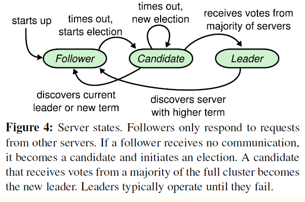
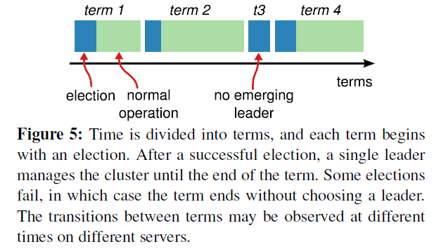
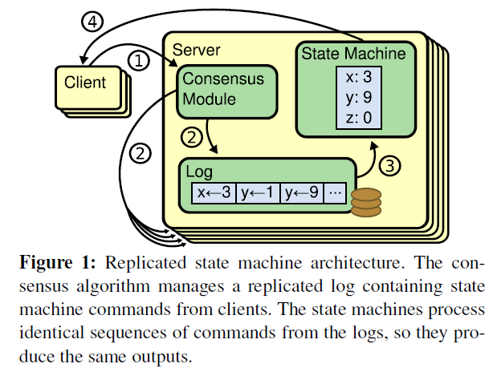
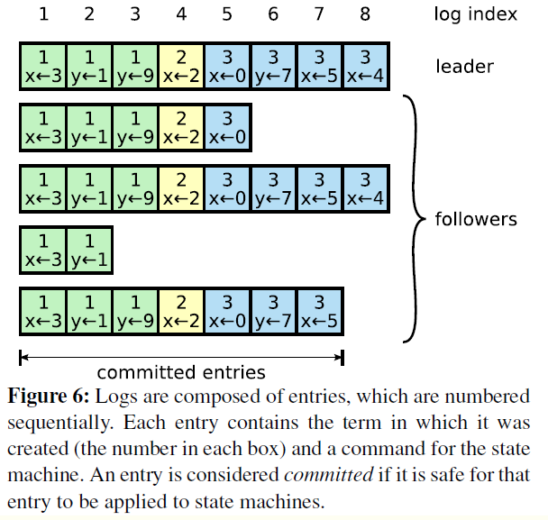
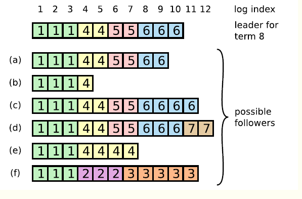
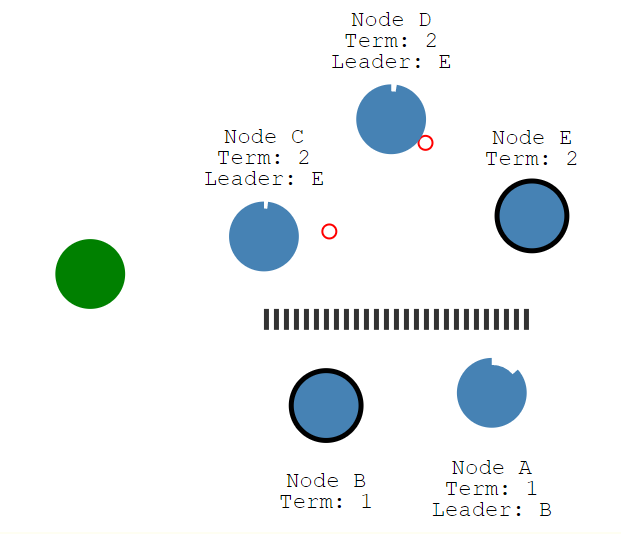
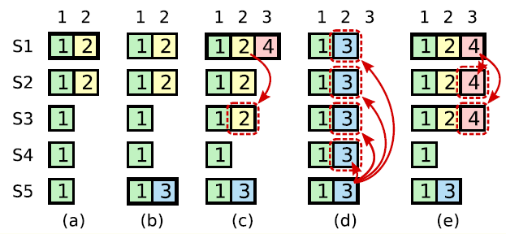
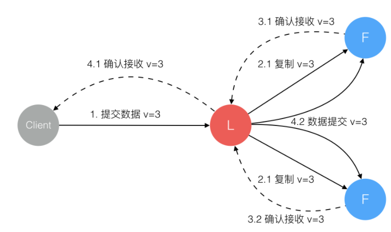

raft会先选举出leader，leader完全负责replicated log的管理。leader负责接受所有客户端更新请求，然后复制到follower节点，并在“安全”的时候执行这些请求。如果leader故障，followes会重新选举出新的leader。

raft协议中，一个节点任一时刻处于以下三个状态之一：

1. leader
2. follower
3. candidate

节点启动时都是follower状态；在一段时间内如果没有收到来自leader的心跳，从follower切换到candidate，发起选举；如果收到多数赞成票（含自己的一票）则切换到leader状态；如果发现其他节点比自己更新任期的leader，则主动切换到follower。

系统中最多只有一个leader，如果在一段时间里发现没有leader，则大家通过选举-投票选出leader。leader会不停的给follower发心跳消息，表明自己的存活状态。如果leader故障，那么follower会转换成candidate，重新选出leader。

哪个节点作为leader是由所有节点投票选举出来的，每个leader工作一段时间，然后选出新的任期的leader继续负责。

任期以选举开始，然后是一段或长或短的稳定工作期。上图第2任期意在表明任期是递增的，另外第3任期展示了一种情况，没有选出leader情况下，会发起新的选举。

## 选举过程

如果follower在选举超时时间内没有收到leader的心跳（也许还没有选出leader，也许leader挂了，也许leader与该follower之间网络故障），则会主动发起选举，步骤如下：

1. 增加本地节点的当前任期，切换到candidate状态

2. 投自己一票

3. 并行给其他节点发送请求投票RPCs

4. 等待其他节点的回复

   这个过程中，根据其他节点的消息，可能出现三种结果

   * 收到多数的投票（含自身一票），赢得选举称为leader，立刻给所有节点发消息，广而告之，避免触发新的选举
   * 被告知别人已当选，则自行切换到follower状态
   * 一段时间内没收到多数投票，则保持candidate状态，重新发起选举

投票者如何决定是否给一个选举请求投票：

* 在任一任期内，单个节点最多只能投一票
* 候选人知道的信息不能比自己少（与日志复制和安全性相关）
* 先来先得

如果多个节点同时发起选举，依据先来先得原则，可能某个节点赢得选举。如果没有节点赢得选举：

* 针对该种情况，raft引入再次主动发起选举前的随机休息时间，并且保证节点数目是奇数个，来避免平票的情况

## 日志复制

当有了leader，系统应该进入对外工作期了。客户端的一切请求来发送到leader，leader来调度这些并发请求的顺序，并且保证leader与followers状态的一致性。raft中的做法是，将这些请求以及执行顺序告知followers。leader和followers以相同的顺序来执行这些请求，保证状态一致。

相同的初识状态 + 相同的输入 = 相同的结束状态

在raft中，leader将客户端请求（command）封装到一个个log entry，将这些log entries复制（replicate）到所有follower节点，然后大家按相同顺序应用（apply）log entry中的command，则状态肯定是一致的。

当leader收到一个来自客户端的写请求，到返回给客户端，整个过程从leader的视角来看会经历以下步骤：

* leader添加一个log条目
* leader并行发出AppendEntries RPC请求
* leader等待获取多数的响应
* leader将条目应用到状态机种
* leader回复客户端
* leader通知follower应用log

logs由顺序编号的log entry组成 ，每个log entry除了包含command，还包含产生该log entry时的leader term。从上图可以看到，五个节点的日志并不完全一致，raft算法为了保证高可用，并不是强一致性，而是最终一致性，leader会不断尝试给follower发log entries，直到所有节点的log entries都相同。

  在上面的流程中，leader只需要日志被复制到大多数节点即可向客户端返回，一旦向客户端返回成功消息，那么系统就必须保证log（其实是log所包含的command）在任何异常的情况下都不会发生回滚。这里有两个词：commit（committed），apply(applied)，前者是指日志被复制到了大多数节点后日志的状态；而后者则是节点将日志应用到状态机，真正影响到节点状态。

选举的安全性：任一任期内，最多一个leader被选出，一个复制集中任何时刻只能有一个leader。

系统中同时有多余一个leader，被称之为脑裂，这是非常严重的问题，会导致数据的覆盖丢失，raft中保证了这个属性：

* 一个节点某一任期内最多只能投一票
* 只有获得多数投票的节点才会成为leader

log匹配的特性：如果两个节点上某个log条目的index相同且任期相同，那么在该index之前的所有log条目都应是相同的。

log匹配依赖于：leader在某一任期的任一位置只会创建一个log条目，且log条目是append-only的，其次，会进行一致性检查，leader在AppendEntries中包含最新log条目之前的一个log的任期和index，如果follower在对应的任期index找不到log，就会告知leader不一致。

## 节点故障

如果出现节点故障，情况会变复杂

注：上图a-f不是6个follower，而是某个follower可能存在的六个状态

leader、follower都可能crash，那么follower维护的log和leader相比可能出现以下情况

* 比leader日志少，如图中ab
* 比leader日志多，如图中cd
* 某些位置比leader多，某些比leader少，如ef（针对某一任期而言）

当出现leader和follower不一致，leader强制follower复制自己的log

leader会维护一个nextIndex[]数组，记录了leader可以发送每一个follower的log index，初始化为eader最后一个log index加1， 前面也提到，leader选举成功之后会立即给所有follower发送AppendEntries RPC（不包含任何log entry， 也充当心跳消息）,那么流程总结为：

> s1 leader 初始化nextIndex[x]为 leader最后一个log index + 1
> s2 AppendEntries里prevLogTerm prevLogIndex来自 logs[nextIndex[x] - 1]
> s3 如果follower判断prevLogIndex位置的log term不等于prevLogTerm，那么返回 False，否则返回True
> s4 leader收到follower的回复，如果返回值是False，则nextIndex[x] -= 1, 跳转到s2. 否则
> s5 同步nextIndex[x]后的所有log entries

leader完整性：如果一个log entry在某个任期被提交（committed），那么这条日志一定会出现在所有更高term的leader的日志里面。这个跟leader election、log replication都有关。

- 一个日志被复制到majority节点才算committed
- 一个节点得到majority的投票才能成为leader，而节点A给节点B投票的其中一个前提是，B的日志不能比A的日志旧。下面的引文指处了如何判断日志的

## 过时的leader

raft保证选举的安全，任一任期内最多只有一个leader，但在网络分割的情况下，可能会出现两个leader，但两个leader所处的任期是不同的

系统有5个节点ABCDE组成，在term1，Node B是leader，但Node A、B和Node C、D、E之间出现了网络分割，因此Node C、D、E无法收到来自leader（Node B）的消息，在election time之后，Node C、D、E会分期选举，由于满足获得大多数投票条件，Node E成为了term 2的leader。因此，在系统中貌似出现了两个leader：term 1的Node B， term 2的Node E, Node B的term更旧，但由于无法与Majority节点通信，NodeB仍然会认为自己是leader。

在这样的情况下，我们来考虑读写。

首先，如果客户端将请求发送到了NodeB，NodeB无法将log entry 复制到majority节点，因此不会告诉客户端写入成功，这就不会有问题。

对于读请求，stale leader可能返回stale data，比如在read-after-write的一致性要求下，客户端写入到了term2任期的leader Node E，但读请求发送到了Node B。如果要保证不返回stale data，leader需要check自己是否过时了，办法就是与大多数节点通信一次，这个可能会出现效率问题。另一种方式是使用lease，但这就会依赖物理时钟。

从raft的论文中可以看到，leader转换成follower的条件是收到来自更高term的消息，如果网络分割一直持续，那么stale leader就会一直存在。而在raft的一些实现或者raft-like协议中，leader如果收不到majority节点的消息，那么可以自己step down，自行转换到follower状态。

## 状态机安全

如果节点将某一位置的log entry应用到了状态机，那么其他节点在同一位置不能应用不同的日志。简单点来说，所有节点在同一位置（index in log entries）应该应用同样的日志。但是似乎有某些情况会违背这个原则：

上图是一个较为复杂的情况。在时刻(a), s1是leader，在term2提交的日志只赋值到了s1 s2两个节点就crash了。在时刻（b), s5成为了term 3的leader，日志只赋值到了s5，然后crash。然后在(c)时刻，s1又成为了term 4的leader，开始赋值日志，于是把term2的日志复制到了s3，此刻，可以看出term2对应的日志已经被复制到了majority，因此是committed，可以被状态机应用。不幸的是，接下来（d）时刻，s1又crash了，s5重新当选，然后将term3的日志复制到所有节点，这就出现了一种奇怪的现象：被复制到大多数节点（或者说可能已经应用）的日志被回滚。

究其根本，是因为term4时的leader s1在（C）时刻提交了之前term2任期的日志。为了杜绝这种情况的发生：

某个leader选举成功之后，不会直接提交前任leader时期的日志，而是通过提交当前任期的日志的时候“顺手”把之前的日志也提交了，具体怎么实现了，在log matching部分有详细介绍。那么问题来了，如果leader被选举后没有收到客户端的请求呢，论文中有提到，在任期开始的时候发立即尝试复制、提交一条空的log

因此，在上图中，不会出现（C）时刻的情况，即term4任期的leader s1不会复制term2的日志到s3。而是如同(e)描述的情况，通过复制-提交 term4的日志顺便提交term2的日志。如果term4的日志提交成功，那么term2的日志也一定提交成功，此时即使s1crash，s5也不会重新当选（候选人知道的信息不能比自身少）

## leader故障

当leader故障时，follower节点会选举新任期的leader，而旧的leader，因为得不到多数节点的确认，不能提交成功，待网络/故障恢复，作为follower更新最新的数据。leader和follower之间复制的流程如下：

## 总结

raft将共识问题分解成两个相对独立的问题，leader election，log replication。流程是先选举出leader，然后leader负责复制、提交log（log中包含command）

  为了在任何异常情况下系统不出错，即满足safety属性，对leader election，log replication两个子问题有诸多约束

leader election约束：

- 同一任期内最多只能投一票，先来先得
- 选举人必须比自己知道的更多（比较term，log index）

log replication约束：

- 一个log被复制到大多数节点，就是committed，保证不会回滚
- leader一定包含最新的committed log，因此leader只会追加日志，不会删除覆盖日志
- 不同节点，某个位置上日志相同，那么这个位置之前的所有日志一定是相同的
- Raft never commits log entries from previous terms by counting replicas.

## 动画演示

[演示(可能需要清下缓存，多刷新)](http://thesecretlivesofdata.com/raft/)

