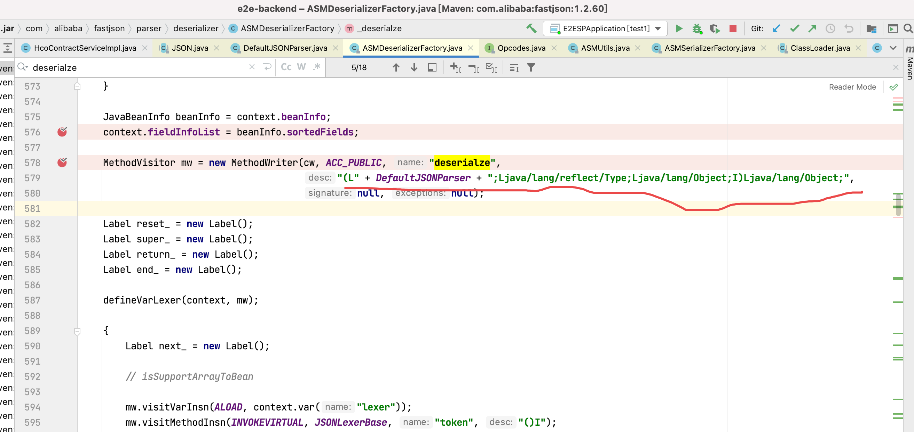

Fastjson parseObject时诡异报错


报错信息

```
Handler dispatch failed; nested exception is java.lang.VerifyError: (class: com/alibaba/fastjson/parser/deserializer/FastjsonASMDeserializer_3_HcoMeeting, method: deserialze signature: (Lcom/alibaba/fastjson/parser/DefaultJSONParser;Ljava/lang/reflect/Type;Ljava/lang/Object;I)Ljava/lang/Object;) Illegal target of jump or branch
```

查看错误堆栈发现问题出现在fastjson反序列化阶段，再查看源码可以发现fastjson反序列化底层使用的ASM字节码操作来生成类，而问题就出现在这个阶段

对于上面报错信息括号内的部分主要是描述报错的类方法特征值，比对fastjson源码生成类内部方法的部分可以发现，特征值与生成的deserialze方法一致（如下图所示）

```
class: com/alibaba/fastjson/parser/deserializer/FastjsonASMDeserializer_3_HcoMeeting
method: deserialze
signature: (Lcom/alibaba/fastjson/parser/DefaultJSONParser;Ljava/lang/reflect/Type;Ljava/lang/Object;I)Ljava/lang/Object;)
```




报错信息最后一句：Illegal target of jump or branch意思则是，指出了字节码出错的地方，在于 goto 字节码的位置，即goto的字节码行号非法

goto字节码会在代码分支的位置出现，比如if分支的时候，yes的情况，会goto某一行代码，else情况又goto另一行代码

例如，如下代码


使用javap查看字节码信息如下，下面标记出两种jump代码的情况


为何问题出现在goto位置，搜索了网上，发现fastjson曾有过类似的bug，显然我们出现的问题和这个不一致（因为我们fastjson的版本1.2.60比他升级完的版本还要高，而且他64个变量就出问题了，debug发现我们有185个类变量），但却指出了一个解释的方向：类变量的数量影响bug出现与否


查看fastjson生成的字节码类的deserialze方法的部分发现，fastjson给deserialze方法加入的字节码主要是循环类变量设置变量值


猜测fastjson还是在这一块存在bug，变量数量很多时，字节码编织时在goto行号处理上存在bug

验证：查看git发现我们在6月8号和6月9号，有往该类新增了两个变量，删除这两个变量后，测试代码，发现不报错了

结论：fastjson存在bug，bug的形成原因，在一定的置信度上认为当类变量数量太大时（或者变量数特定值下），会诱发fastjson的bug

修复方案：该报错代码的目的在使用fastjson复制对象，修复时，我把复制对象代码换成了第三方库*Kryo的实现*