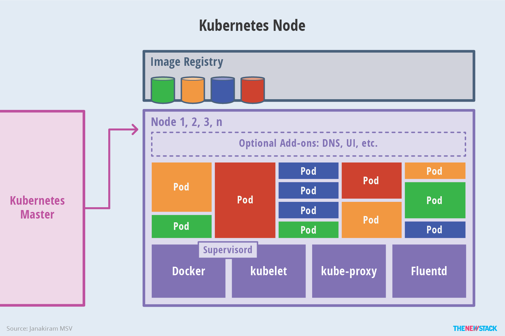

## （一）概念初览

Kubernetes所有的资源都有一个独立的URI，URI的组成

1. 对象的类型（如：pod）
2. 对象的名字
3. 对象的命名空间（不提供时使用默认命名空间）


所有的容器均运行在Pod中，一个Pod可以承载一个或多个容器，同一个Pod中的容器部署在同一物理机并且能共享资源，一个Pod可以有多个磁盘卷组（volumes）。一个应用的多个Pod也可以共享一个机器。

用户创建Pod后，系统会自动选择健康并且容量足够的机器来创建容器，容器创建失败时，node agent（`kubelet`）会自动重启，但如果是Pod失败或机器失败，不会自动转移与重启，除非定义了replication controller。“replication controller”负责重新启动、迁移Pod，它根据模版创建Pod，并根据需求创建了冗余，这些冗余的Pod组成了一个整体应用，一个Pod被创建后系统会不停的健康Pod与所在主机的健康情况，一旦挂掉了，会自动在一个健康的机器上创建一样的Pod，以维持冗余状态不变。


Kubernetes支持特殊的网络模型，Kubernetes创建了一个地址空间，不切不动态分配端口，运行用户选择任何想使用的端口，为了实现这个功能，它为每个Pod分配了IP地址。Kubernetes提供了固定的IP地址和DNS名称，这些（通过Pod上绑定的标签键值对）与一系列Pod进行动态关联，当Pod中容器访问这个地址时，请求会被转发到本地代理（kube proxy，每台机器上均有一个本地代理），然后转发到对应的后端容器。Kubernetes通过轮询机制选择相应的后端容器，即使Pod被替换，Kube proxy也能及时追踪，所以服务的IP地址（dns名称）是固定的。


## （二）技术架构

Kubernetes集群包含有节点代理kubelet和Master组件(APIs, scheduler, etc)，一切都基于分布式的存储系统。下面这张图是Kubernetes的架构图。


### 1. Kubernetes节点

在这张系统架构图中，我们把服务分为运行在工作节点上的服务和组成集群级别控制板的服务。

Kubernetes节点有运行应用容器必备的服务，而这些都是受Master的控制。

每次个节点上当然都要运行Docker。Docker来负责所有具体的映像下载和容器运行。

Kubernetes主要由以下几个核心组件组成：

- etcd保存了整个集群的状态；
- apiserver提供了资源操作的唯一入口，并提供认证、授权、访问控制、API注册和发现等机制；
- controller manager负责维护集群的状态，比如故障检测、自动扩展、滚动更新等；
- scheduler负责资源的调度，按照预定的调度策略将Pod调度到相应的机器上；
- kubelet负责维护容器的生命周期，同时也负责Volume（CVI）和网络（CNI）的管理；
- Container runtime负责镜像管理以及Pod和容器的真正运行（CRI）；
- kube-proxy负责为Service提供cluster内部的服务发现和负载均衡；

除了核心组件，还有一些推荐的插件（Add-ons）：

- kube-dns负责为整个集群提供DNS服务
- Ingress Controller为服务提供外网入口
- Heapster提供资源监控
- Dashboard提供GUI
- Federation提供跨可用区的集群
- Fluentd-elasticsearch提供集群日志采集、存储与查询




### 2. 分层理念

Kubernetes设计理念和功能其实就是一个类似Linux的分层架构，如下图所示


- 核心层：Kubernetes最核心的功能，对外提供API构建高层的应用，对内提供插件式应用执行环境
- 应用层：部署（无状态应用、有状态应用、批处理任务、集群应用等）和路由（服务发现、DNS解析等）
- 管理层：系统度量（如基础设施、容器和网络的度量），自动化（如自动扩展、动态Provision等）以及策略管理（RBAC、Quota、PSP、NetworkPolicy等）
- 接口层：kubectl命令行工具、客户端SDK以及集群联邦
- 生态系统：在接口层之上的庞大容器集群管理调度的生态系统，可以划分为两个范畴
  - Kubernetes外部：日志、监控、配置管理、CI、CD、Workflow、FaaS、OTS应用、ChatOps等
  - Kubernetes内部：CRI、CNI、CVI、镜像仓库、Cloud Provider、集群自身的配置和管理等

### 3. kubelet

kubelet负责管理[pods](https://www.kubernetes.org.cn/kubernetes-pod)和它们上面的容器，images镜像、volumes、etc。

### 4. kube-proxy

每一个节点也运行一个简单的网络代理和负载均衡（详见[services FAQ](https://github.com/kubernetes/kubernetes/wiki/Services-FAQ) )（PS:官方 英文）。 正如Kubernetes API里面定义的这些服务（详见[the services doc](https://github.com/kubernetes/kubernetes/blob/release-1.2/docs/user-guide/services.md)）（PS:官方 英文）也可以在各种终端中以轮询的方式做一些简单的TCP和UDP传输。

服务端点目前是通过DNS或者环境变量( Docker-links-compatible 和 Kubernetes{FOO}_SERVICE_HOST 及 {FOO}_SERVICE_PORT 变量都支持)。这些变量由服务代理所管理的端口来解析。

### 5. Kubernetes控制面板

Kubernetes控制面板可以分为多个部分。目前它们都运行在一个*master* 节点，然而为了达到高可用性，这需要改变。不同部分一起协作提供一个统一的关于集群的视图。

### 6. etcd

所有master的持续状态都存在etcd（分布式键值存储系统）的一个实例中。这可以很好地存储配置数据。因为有watch(观察者)的支持，各部件协调中的改变可以很快被察觉。

### 7. Kubernetes API Server

API服务提供[Kubernetes API](https://github.com/kubernetes/kubernetes/blob/release-1.2/docs/api.md) （PS:官方 英文）的服务。这个服务试图通过把所有或者大部分的业务逻辑放到不两只的部件中从而使其具有CRUD特性。它主要处理REST操作，在etcd中验证更新这些对象（并最终存储）。

### 8. Scheduler

调度器把未调度的pod通过binding api绑定到节点上。调度器是可插拔的，并且我们期待支持多集群的调度，未来甚至希望可以支持用户自定义的调度器。

### 9. Kubernetes控制管理服务器

所有其它的集群级别的功能目前都是由控制管理器所负责。例如，端点对象是被端点控制器来创建和更新。这些最终可以被分隔成不同的部件来让它们独自的可插拔。

[replicationcont](https://github.com/kubernetes/kubernetes/blob/release-1.2/docs/user-guide/replication-controller.md)[roller](https://github.com/kubernetes/kubernetes/blob/release-1.2/docs/user-guide/replication-controller.md)（PS:官方 英文）是一种建立于简单的 [pod](https://www.kubernetes.org.cn/kubernetes-pod) API之上的一种机制。一旦实现，我们最终计划把这变成一种通用的插件机制。

##  （三）API对象

每个API对象都有3大类属性：元数据metadata、规范spec和状态status。元数据是用来标识API对象的，每个对象都至少有3个元数据：namespace，name和uid；除此以外还有各种各样的标签labels用来标识和匹配不同的对象，例如用户可以用标签env来标识区分不同的服务部署环境，分别用env=dev、env=testing、env=production来标识开发、测试、生产的不同服务。规范描述了用户期望K8s集群中的分布式系统达到的理想状态（Desired State），例如用户可以通过复制控制器Replication Controller设置期望的Pod副本数为3；status描述了系统实际当前达到的状态（Status），例如系统当前实际的Pod副本数为2；那么复制控制器当前的程序逻辑就是自动启动新的Pod，争取达到副本数为3。

K8s中所有的配置都是通过API对象的spec去设置的，也就是用户通过配置系统的理想状态来改变系统，这是k8s重要设计理念之一，即所有的操作都是声明式（Declarative）的而不是命令式（Imperative）的。声明式操作在分布式系统中的好处是稳定，不怕丢操作或运行多次，例如设置副本数为3的操作运行多次也还是一个结果，而给副本数加1的操作就不是声明式的，运行多次结果就错了。

### 1. Pod

K8s有很多技术概念，同时对应很多API对象，最重要的也是最基础的是微服务Pod。Pod是在K8s集群中运行部署应用或服务的最小单元，它是可以支持多容器的。Pod的设计理念是支持多个容器在一个Pod中共享网络地址和文件系统，可以通过进程间通信和文件共享这种简单高效的方式组合完成服务。Pod对多容器的支持是K8s最基础的设计理念。比如你运行一个操作系统发行版的软件仓库，一个Nginx容器用来发布软件，另一个容器专门用来从源仓库做同步，这两个容器的镜像不太可能是一个团队开发的，但是他们一块儿工作才能提供一个微服务；这种情况下，不同的团队各自开发构建自己的容器镜像，在部署的时候组合成一个微服务对外提供服务。

Pod是K8s集群中所有业务类型的基础，可以看作运行在K8s集群中的小机器人，不同类型的业务就需要不同类型的小机器人去执行。目前K8s中的业务主要可以分为长期伺服型（long-running）、批处理型（batch）、节点后台支撑型（node-daemon）和有状态应用型（stateful application）；分别对应的小机器人控制器为Deployment、Job、DaemonSet和PetSet，本文后面会一一介绍。

### 2. 复制控制器（Replication Controller，RC）

RC是K8s集群中最早的保证Pod高可用的API对象。通过监控运行中的Pod来保证集群中运行指定数目的Pod副本。指定的数目可以是多个也可以是1个；少于指定数目，RC就会启动运行新的Pod副本；多于指定数目，RC就会杀死多余的Pod副本。即使在指定数目为1的情况下，通过RC运行Pod也比直接运行Pod更明智，因为RC也可以发挥它高可用的能力，保证永远有1个Pod在运行。RC是K8s较早期的技术概念，只适用于长期伺服型的业务类型，比如控制小机器人提供高可用的Web服务。

### 3. 副本集（Replica Set，RS）

RS是新一代RC，提供同样的高可用能力，区别主要在于RS后来居上，能支持更多种类的匹配模式。副本集对象一般不单独使用，而是作为Deployment的理想状态参数使用。

### 4. 部署(Deployment)

部署表示用户对K8s集群的一次更新操作。部署是一个比RS应用模式更广的API对象，可以是创建一个新的服务，更新一个新的服务，也可以是滚动升级一个服务。滚动升级一个服务，实际是创建一个新的RS，然后逐渐将新RS中副本数增加到理想状态，将旧RS中的副本数减小到0的复合操作；这样一个复合操作用一个RS是不太好描述的，所以用一个更通用的Deployment来描述。以K8s的发展方向，未来对所有长期伺服型的的业务的管理，都会通过Deployment来管理。

### 5. 服务（Service）

RC、RS和Deployment只是保证了支撑服务的微服务Pod的数量，但是没有解决如何访问这些服务的问题。一个Pod只是一个运行服务的实例，随时可能在一个节点上停止，在另一个节点以一个新的IP启动一个新的Pod，因此不能以确定的IP和端口号提供服务。要稳定地提供服务需要服务发现和负载均衡能力。服务发现完成的工作，是针对客户端访问的服务，找到对应的的后端服务实例。在K8s集群中，客户端需要访问的服务就是Service对象。每个Service会对应一个集群内部有效的虚拟IP，集群内部通过虚拟IP访问一个服务。在K8s集群中微服务的负载均衡是由Kube-proxy实现的。Kube-proxy是K8s集群内部的负载均衡器。它是一个分布式代理服务器，在K8s的每个节点上都有一个；这一设计体现了它的伸缩性优势，需要访问服务的节点越多，提供负载均衡能力的Kube-proxy就越多，高可用节点也随之增多。与之相比，我们平时在服务器端做个反向代理做负载均衡，还要进一步解决反向代理的负载均衡和高可用问题。

### 6. 任务（Job）

Job是K8s用来控制批处理型任务的API对象。批处理业务与长期伺服业务的主要区别是批处理业务的运行有头有尾，而长期伺服业务在用户不停止的情况下永远运行。Job管理的Pod根据用户的设置把任务成功完成就自动退出了。成功完成的标志根据不同的spec.completions策略而不同：单Pod型任务有一个Pod成功就标志完成；定数成功型任务保证有N个任务全部成功；工作队列型任务根据应用确认的全局成功而标志成功。

### 7. 后台支撑服务集（DaemonSet）

长期伺服型和批处理型服务的核心在业务应用，可能有些节点运行多个同类业务的Pod，有些节点上又没有这类Pod运行；而后台支撑型服务的核心关注点在K8s集群中的节点（物理机或虚拟机），要保证每个节点上都有一个此类Pod运行。节点可能是所有集群节点也可能是通过nodeSelector选定的一些特定节点。典型的后台支撑型服务包括，存储，日志和监控等在每个节点上支持K8s集群运行的服务。

### 8. 有状态服务集（PetSet）

K8s在1.3版本里发布了Alpha版的PetSet功能。在云原生应用的体系里，有下面两组近义词；第一组是无状态（stateless）、牲畜（cattle）、无名（nameless）、可丢弃（disposable）；第二组是有状态（stateful）、宠物（pet）、有名（having name）、不可丢弃（non-disposable）。RC和RS主要是控制提供无状态服务的，其所控制的Pod的名字是随机设置的，一个Pod出故障了就被丢弃掉，在另一个地方重启一个新的Pod，名字变了、名字和启动在哪儿都不重要，重要的只是Pod总数；而PetSet是用来控制有状态服务，PetSet中的每个Pod的名字都是事先确定的，不能更改。PetSet中Pod的名字的作用，并不是《千与千寻》的人性原因，而是关联与该Pod对应的状态。

对于RC和RS中的Pod，一般不挂载存储或者挂载共享存储，保存的是所有Pod共享的状态，Pod像牲畜一样没有分别（这似乎也确实意味着失去了人性特征）；对于PetSet中的Pod，每个Pod挂载自己独立的存储，如果一个Pod出现故障，从其他节点启动一个同样名字的Pod，要挂载上原来Pod的存储继续以它的状态提供服务。

适合于PetSet的业务包括数据库服务MySQL和PostgreSQL，集群化管理服务Zookeeper、etcd等有状态服务。PetSet的另一种典型应用场景是作为一种比普通容器更稳定可靠的模拟虚拟机的机制。传统的虚拟机正是一种有状态的宠物，运维人员需要不断地维护它，容器刚开始流行时，我们用容器来模拟虚拟机使用，所有状态都保存在容器里，而这已被证明是非常不安全、不可靠的。使用PetSet，Pod仍然可以通过漂移到不同节点提供高可用，而存储也可以通过外挂的存储来提供高可靠性，PetSet做的只是将确定的Pod与确定的存储关联起来保证状态的连续性。PetSet还只在Alpha阶段，后面的设计如何演变，我们还要继续观察。

### 9. 集群联邦（Federation）

K8s在1.3版本里发布了beta版的Federation功能。在云计算环境中，服务的作用距离范围从近到远一般可以有：同主机（Host，Node）、跨主机同可用区（Available Zone）、跨可用区同地区（Region）、跨地区同服务商（Cloud Service Provider）、跨云平台。K8s的设计定位是单一集群在同一个地域内，因为同一个地区的网络性能才能满足K8s的调度和计算存储连接要求。而联合集群服务就是为提供跨Region跨服务商K8s集群服务而设计的。

每个K8s Federation有自己的分布式存储、API Server和Controller Manager。用户可以通过Federation的API Server注册该Federation的成员K8s Cluster。当用户通过Federation的API Server创建、更改API对象时，Federation API Server会在自己所有注册的子K8s Cluster都创建一份对应的API对象。在提供业务请求服务时，K8s Federation会先在自己的各个子Cluster之间做负载均衡，而对于发送到某个具体K8s Cluster的业务请求，会依照这个K8s Cluster独立提供服务时一样的调度模式去做K8s Cluster内部的负载均衡。而Cluster之间的负载均衡是通过域名服务的负载均衡来实现的。

所有的设计都尽量不影响K8s Cluster现有的工作机制，这样对于每个子K8s集群来说，并不需要更外层的有一个K8s Federation，也就是意味着所有现有的K8s代码和机制不需要因为Federation功能有任何变化。

### 10. 存储卷（Volume）

K8s集群中的存储卷跟Docker的存储卷有些类似，只不过Docker的存储卷作用范围为一个容器，而K8s的存储卷的生命周期和作用范围是一个Pod。每个Pod中声明的存储卷由Pod中的所有容器共享。K8s支持非常多的存储卷类型，特别的，支持多种公有云平台的存储，包括AWS，Google和Azure云；支持多种分布式存储包括GlusterFS和Ceph；也支持较容易使用的主机本地目录hostPath和NFS。K8s还支持使用Persistent Volume Claim即PVC这种逻辑存储，使用这种存储，使得存储的使用者可以忽略后台的实际存储技术（例如AWS，Google或GlusterFS和Ceph），而将有关存储实际技术的配置交给存储管理员通过Persistent Volume来配置。

### 11. 持久存储卷（Persistent Volume，PV）和持久存储卷声明（Persistent Volume Claim，PVC）

PV和PVC使得K8s集群具备了存储的逻辑抽象能力，使得在配置Pod的逻辑里可以忽略对实际后台存储技术的配置，而把这项配置的工作交给PV的配置者，即集群的管理者。存储的PV和PVC的这种关系，跟计算的Node和Pod的关系是非常类似的；PV和Node是资源的提供者，根据集群的基础设施变化而变化，由K8s集群管理员配置；而PVC和Pod是资源的使用者，根据业务服务的需求变化而变化，有K8s集群的使用者即服务的管理员来配置。

### 12. 节点（Node）

K8s集群中的计算能力由Node提供，最初Node称为服务节点Minion，后来改名为Node。K8s集群中的Node也就等同于Mesos集群中的Slave节点，是所有Pod运行所在的工作主机，可以是物理机也可以是虚拟机。不论是物理机还是虚拟机，工作主机的统一特征是上面要运行kubelet管理节点上运行的容器。

### 13. 密钥对象（Secret）

Secret是用来保存和传递密码、密钥、认证凭证这些敏感信息的对象。使用Secret的好处是可以避免把敏感信息明文写在配置文件里。在K8s集群中配置和使用服务不可避免的要用到各种敏感信息实现登录、认证等功能，例如访问AWS存储的用户名密码。为了避免将类似的敏感信息明文写在所有需要使用的配置文件中，可以将这些信息存入一个Secret对象，而在配置文件中通过Secret对象引用这些敏感信息。这种方式的好处包括：意图明确，避免重复，减少暴漏机会。

### 14. 用户帐户（User Account）和服务帐户（Service Account）

顾名思义，用户帐户为人提供账户标识，而服务账户为计算机进程和K8s集群中运行的Pod提供账户标识。用户帐户和服务帐户的一个区别是作用范围；用户帐户对应的是人的身份，人的身份与服务的namespace无关，所以用户账户是跨namespace的；而服务帐户对应的是一个运行中程序的身份，与特定namespace是相关的。

### 15. 名字空间（Namespace）

名字空间为K8s集群提供虚拟的隔离作用，K8s集群初始有两个名字空间，分别是默认名字空间default和系统名字空间kube-system，除此以外，管理员可以可以创建新的名字空间满足需要。

### 16. RBAC访问授权

K8s在1.3版本中发布了alpha版的基于角色的访问控制（Role-based Access Control，RBAC）的授权模式。相对于基于属性的访问控制（Attribute-based Access Control，ABAC），RBAC主要是引入了角色（Role）和角色绑定（RoleBinding）的抽象概念。在ABAC中，K8s集群中的访问策略只能跟用户直接关联；而在RBAC中，访问策略可以跟某个角色关联，具体的用户在跟一个或多个角色相关联。显然，RBAC像其他新功能一样，每次引入新功能，都会引入新的API对象，从而引入新的概念抽象，而这一新的概念抽象一定会使集群服务管理和使用更容易扩展和重用。


## （四）安装

### 1. 准备环境

Centos 8.4.2105

| 名称   | IP          |      |
| ------ | ----------- | ---- |
| master | 172.20.1.57 |      |
| etcd   | 172.20.1.57 |      |
| node-2 | 172.20.1.58 |      |

master已安装docker，docker配置阿里云镜像加速vim /etc/docker/daemon.json，并重启docker

```
{
   "registry-mirrors" : ["https://mj9kvemk.mirror.aliyuncs.com"]
}
```


hosts文件已添加配置

```
172.20.1.57 master
172.20.1.57 etcd3
172.20.1.58 k8s-node2
```

配置kubernetes源vim /etc/yum.repos.d/kubernetes.repo

```
[kubernetes]
name=Kubernetes
baseurl=https://mirrors.aliyun.com/kubernetes/yum/repos/kubernetes-el7-x86_64/
enabled=1
gpgcheck=0
repo_gpgcheck=0
gpgkey=https://mirrors.aliyun.com/kubernetes/yum/doc/yum-key.gpg https://mirrors.aliyun.com/kubernetes/yum/doc/rpm-package-key.gpg
```

禁用selinux

```
setenforce 0
```

关闭防火墙

```
systemctl stop firewalld.service
systemctl disable firewalld.service
```

### 2. 安装过程

安装kubectl、kubelet、kubeadm：yum install -y kubectl kubelet kubeadm

```
[root@iZwz9399m95nhbhgm1qnhtZ ~]# yum install -y kubectl-1.21.2 kubelet-1.21.2 kubeadm-1.21.2
...
已安装:
  conntrack-tools-1.4.4-10.el8.x86_64      cri-tools-1.13.0-0.x86_64        kubeadm-1.21.2-0.x86_64                      kubectl-1.21.2-0.x86_64                      
  kubelet-1.21.2-0.x86_64                  kubernetes-cni-0.8.7-0.x86_64    libnetfilter_cthelper-1.0.0-15.el8.x86_64    libnetfilter_cttimeout-1.0.0-11.el8.x86_64   
  libnetfilter_queue-1.0.4-3.el8.x86_64    socat-1.7.3.3-2.el8.x86_64      

完毕！
```

修改docker Cgroup为与kube一致，否则初始化集群会失败。从cgroupfs改为systemd，在ExecStart命令中添加

```
--exec-opt native.cgroupdriver=systemd
```

```
[root@iZwz9399m95nhbhgm1qnhtZ ~]# vim /usr/lib/systemd/system/docker.service
...
[Service]
Type=notify
# the default is not to use systemd for cgroups because the delegate issues still
# exists and systemd currently does not support the cgroup feature set required
# for containers run by docker
ExecStart=/usr/bin/dockerd -H fd:// --containerd=/run/containerd/containerd.sock --exec-opt native.cgroupdriver=systemd
ExecReload=/bin/kill -s HUP $MAINPID
TimeoutSec=0
RestartSec=2
Restart=always
```

重启docker并再次查看docker Cgroup，已切换为systemd

```
[root@iZwz9399m95nhbhgm1qnhtZ ~]# systemctl daemon-reload
[root@iZwz9399m95nhbhgm1qnhtZ ~]# service docker restart
Redirecting to /bin/systemctl restart docker.service
[root@iZwz9399m95nhbhgm1qnhtZ ~]# docker info |grep Cgroup
 Cgroup Driver: systemd
 Cgroup Version: 1
```

初始化集群配置，看到`Your Kubernetes control-plane has initialized successfully!`配置成功

```
[root@iZwz9399m95nhbhgm1qnhtZ ~]# kubeadm init --apiserver-advertise-address=0.0.0.0 \
--apiserver-cert-extra-sans=127.0.0.1 \
--image-repository=registry.aliyuncs.com/google_containers \
--ignore-preflight-errors=all \
--kubernetes-version=v1.21.2 \
--service-cidr=172.21.0.0/16 \
--pod-network-cidr=172.22.0.0/16
[init] Using Kubernetes version: v1.21.2
[preflight] Running pre-flight checks
	[WARNING FileExisting-tc]: tc not found in system path
	[WARNING Service-Kubelet]: kubelet service is not enabled, please run 'systemctl enable kubelet.service'
[preflight] Pulling images required for setting up a Kubernetes cluster
[preflight] This might take a minute or two, depending on the speed of your internet connection
[preflight] You can also perform this action in beforehand using 'kubeadm config images pull'
	[WARNING ImagePull]: failed to pull image registry.aliyuncs.com/google_containers/coredns:v1.8.0: output: Error response from daemon: manifest for registry.aliyuncs.com/google_containers/coredns:v1.8.0 not found: manifest unknown: manifest unknown
, error: exit status 1
[certs] Using certificateDir folder "/etc/kubernetes/pki"
[certs] Generating "ca" certificate and key
[certs] Generating "apiserver" certificate and key
[certs] apiserver serving cert is signed for DNS names [izwz9399m95nhbhgm1qnhtz kubernetes kubernetes.default kubernetes.default.svc kubernetes.default.svc.cluster.local] and IPs [172.21.0.1 172.20.1.57 127.0.0.1]
[certs] Generating "apiserver-kubelet-client" certificate and key
[certs] Generating "front-proxy-ca" certificate and key
[certs] Generating "front-proxy-client" certificate and key
[certs] Generating "etcd/ca" certificate and key
[certs] Generating "etcd/server" certificate and key
[certs] etcd/server serving cert is signed for DNS names [izwz9399m95nhbhgm1qnhtz localhost] and IPs [172.20.1.57 127.0.0.1 ::1]
[certs] Generating "etcd/peer" certificate and key
[certs] etcd/peer serving cert is signed for DNS names [izwz9399m95nhbhgm1qnhtz localhost] and IPs [172.20.1.57 127.0.0.1 ::1]
[certs] Generating "etcd/healthcheck-client" certificate and key
[certs] Generating "apiserver-etcd-client" certificate and key
[certs] Generating "sa" key and public key
[kubeconfig] Using kubeconfig folder "/etc/kubernetes"
[kubeconfig] Writing "admin.conf" kubeconfig file
[kubeconfig] Writing "kubelet.conf" kubeconfig file
[kubeconfig] Writing "controller-manager.conf" kubeconfig file
[kubeconfig] Writing "scheduler.conf" kubeconfig file
[kubelet-start] Writing kubelet environment file with flags to file "/var/lib/kubelet/kubeadm-flags.env"
[kubelet-start] Writing kubelet configuration to file "/var/lib/kubelet/config.yaml"
[kubelet-start] Starting the kubelet
[control-plane] Using manifest folder "/etc/kubernetes/manifests"
[control-plane] Creating static Pod manifest for "kube-apiserver"
[control-plane] Creating static Pod manifest for "kube-controller-manager"
[control-plane] Creating static Pod manifest for "kube-scheduler"
[etcd] Creating static Pod manifest for local etcd in "/etc/kubernetes/manifests"
[wait-control-plane] Waiting for the kubelet to boot up the control plane as static Pods from directory "/etc/kubernetes/manifests". This can take up to 4m0s
[apiclient] All control plane components are healthy after 15.002052 seconds
[upload-config] Storing the configuration used in ConfigMap "kubeadm-config" in the "kube-system" Namespace
[kubelet] Creating a ConfigMap "kubelet-config-1.21" in namespace kube-system with the configuration for the kubelets in the cluster
[upload-certs] Skipping phase. Please see --upload-certs
[mark-control-plane] Marking the node izwz9399m95nhbhgm1qnhtz as control-plane by adding the labels: [node-role.kubernetes.io/master(deprecated) node-role.kubernetes.io/control-plane node.kubernetes.io/exclude-from-external-load-balancers]
[mark-control-plane] Marking the node izwz9399m95nhbhgm1qnhtz as control-plane by adding the taints [node-role.kubernetes.io/master:NoSchedule]
[bootstrap-token] Using token: 3w8yen.hpyfb5jtm575e6ck
[bootstrap-token] Configuring bootstrap tokens, cluster-info ConfigMap, RBAC Roles
[bootstrap-token] configured RBAC rules to allow Node Bootstrap tokens to get nodes
[bootstrap-token] configured RBAC rules to allow Node Bootstrap tokens to post CSRs in order for nodes to get long term certificate credentials
[bootstrap-token] configured RBAC rules to allow the csrapprover controller automatically approve CSRs from a Node Bootstrap Token
[bootstrap-token] configured RBAC rules to allow certificate rotation for all node client certificates in the cluster
[bootstrap-token] Creating the "cluster-info" ConfigMap in the "kube-public" namespace
[kubelet-finalize] Updating "/etc/kubernetes/kubelet.conf" to point to a rotatable kubelet client certificate and key
[addons] Applied essential addon: CoreDNS
[addons] Applied essential addon: kube-proxy

Your Kubernetes control-plane has initialized successfully!

To start using your cluster, you need to run the following as a regular user:

  mkdir -p $HOME/.kube
  sudo cp -i /etc/kubernetes/admin.conf $HOME/.kube/config
  sudo chown $(id -u):$(id -g) $HOME/.kube/config

Alternatively, if you are the root user, you can run:

  export KUBECONFIG=/etc/kubernetes/admin.conf

You should now deploy a pod network to the cluster.
Run "kubectl apply -f [podnetwork].yaml" with one of the options listed at:
  https://kubernetes.io/docs/concepts/cluster-administration/addons/

Then you can join any number of worker nodes by running the following on each as root:

kubeadm join 172.20.1.57:6443 --token jjizpo.jf2jvm38ozo1aryr \
	--discovery-token-ca-cert-hash sha256:f2b81a905ddd39a091871a9491e08b309d0ceb18730dd3da4167e48b4d61a6bc
```

运行提示中的命令

```
[root@iZwz9399m95nhbhgm1qnhtZ ~]# mkdir -p $HOME/.kube
[root@iZwz9399m95nhbhgm1qnhtZ ~]# cp -i /etc/kubernetes/admin.conf $HOME/.kube/config
[root@iZwz9399m95nhbhgm1qnhtZ ~]# chown $(id -u):$(id -g) $HOME/.kube/config
[root@iZwz9399m95nhbhgm1qnhtZ ~]#
```

PS：后续node节点加入集群只需执行

```
kubeadm join 172.20.1.57:6443 --token jjizpo.jf2jvm38ozo1aryr \
	--discovery-token-ca-cert-hash sha256:f2b81a905ddd39a091871a9491e08b309d0ceb18730dd3da4167e48b4d61a6bc
```

再运行命令

```
[root@iZwz9399m95nhbhgm1qnhtZ ~]# kubectl get node 
NAME                      STATUS     ROLES                  AGE   VERSION
izwz9399m95nhbhgm1qnhtz   NotReady   control-plane,master   10m   v1.21.2
[root@iZwz9399m95nhbhgm1qnhtZ ~]# 
[root@iZwz9399m95nhbhgm1qnhtZ ~]# kubectl get pod --all-namespaces
NAMESPACE     NAME                                              READY   STATUS    RESTARTS   AGE
kube-system   coredns-59d64cd4d4-crjgr                          0/1     Pending   0          10m
kube-system   coredns-59d64cd4d4-cvl4t                          0/1     Pending   0          10m
kube-system   etcd-izwz9399m95nhbhgm1qnhtz                      1/1     Running   0          10m
kube-system   kube-apiserver-izwz9399m95nhbhgm1qnhtz            1/1     Running   0          10m
kube-system   kube-controller-manager-izwz9399m95nhbhgm1qnhtz   1/1     Running   0          10m
kube-system   kube-proxy-gt9r8                                  1/1     Running   0          10m
kube-system   kube-scheduler-izwz9399m95nhbhgm1qnhtz            1/1     Running   0          10m
[root@iZwz9399m95nhbhgm1qnhtZ ~]#
```

master节点为NotReady，因为coredns pod没有启动，缺少网络pod

### 3. 安装calico网络

其他网络通信替代方案还有：flannel、weave等，不同的物理机（或虚拟机器）以及不同的OS系统也会导致可选的方案不同（参考这个页面上的表格https://www.kubernetes.org.cn/doc-4）

应用远程配置文件安装

```
[root@iZwz9399m95nhbhgm1qnhtZ ~]# kubectl apply -f https://docs.projectcalico.org/manifests/calico.yaml
configmap/calico-config created
customresourcedefinition.apiextensions.k8s.io/bgpconfigurations.crd.projectcalico.org created
customresourcedefinition.apiextensions.k8s.io/bgppeers.crd.projectcalico.org created
customresourcedefinition.apiextensions.k8s.io/blockaffinities.crd.projectcalico.org created
customresourcedefinition.apiextensions.k8s.io/clusterinformations.crd.projectcalico.org created
customresourcedefinition.apiextensions.k8s.io/felixconfigurations.crd.projectcalico.org created
customresourcedefinition.apiextensions.k8s.io/globalnetworkpolicies.crd.projectcalico.org created
customresourcedefinition.apiextensions.k8s.io/globalnetworksets.crd.projectcalico.org created

customresourcedefinition.apiextensions.k8s.io/hostendpoints.crd.projectcalico.org created
customresourcedefinition.apiextensions.k8s.io/ipamblocks.crd.projectcalico.org created
customresourcedefinition.apiextensions.k8s.io/ipamconfigs.crd.projectcalico.org created
customresourcedefinition.apiextensions.k8s.io/ipamhandles.crd.projectcalico.org created
customresourcedefinition.apiextensions.k8s.io/ippools.crd.projectcalico.org created
customresourcedefinition.apiextensions.k8s.io/kubecontrollersconfigurations.crd.projectcalico.org created
customresourcedefinition.apiextensions.k8s.io/networkpolicies.crd.projectcalico.org created
customresourcedefinition.apiextensions.k8s.io/networksets.crd.projectcalico.org created
clusterrole.rbac.authorization.k8s.io/calico-kube-controllers created
clusterrolebinding.rbac.authorization.k8s.io/calico-kube-controllers created
clusterrole.rbac.authorization.k8s.io/calico-node created
clusterrolebinding.rbac.authorization.k8s.io/calico-node created
daemonset.apps/calico-node created
serviceaccount/calico-node created
deployment.apps/calico-kube-controllers created
serviceaccount/calico-kube-controllers created
Warning: policy/v1beta1 PodDisruptionBudget is deprecated in v1.21+, unavailable in v1.25+; use policy/v1 PodDisruptionBudget
poddisruptionbudget.policy/calico-kube-controllers created
[root@iZwz9399m95nhbhgm1qnhtZ ~]# 
```

重新查看

```
[root@iZwz9399m95nhbhgm1qnhtZ ~]# kubectl get node
NAME                      STATUS   ROLES                  AGE   VERSION
izwz9399m95nhbhgm1qnhtz   Ready    control-plane,master   69m   v1.21.2
[root@iZwz9399m95nhbhgm1qnhtZ ~]# kubectl get pod --all-namespaces
NAMESPACE     NAME                                              READY   STATUS         RESTARTS   AGE
kube-system   calico-kube-controllers-78d6f96c7b-kv5kb          1/1     Running        0          2m21s
kube-system   calico-node-t862z                                 1/1     Running        0          2m21s
kube-system   coredns-59d64cd4d4-crjgr                          0/1     ErrImagePull   0          69m
kube-system   coredns-59d64cd4d4-cvl4t                          0/1     ErrImagePull   0          69m
kube-system   etcd-izwz9399m95nhbhgm1qnhtz                      1/1     Running        0          69m
kube-system   kube-apiserver-izwz9399m95nhbhgm1qnhtz            1/1     Running        0          69m
kube-system   kube-controller-manager-izwz9399m95nhbhgm1qnhtz   1/1     Running        0          69m
kube-system   kube-proxy-gt9r8                                  1/1     Running        0          69m
kube-system   kube-scheduler-izwz9399m95nhbhgm1qnhtz            1/1     Running        0          69m
[root@iZwz9399m95nhbhgm1qnhtZ ~]#
```

node节点已经是ready了，但coredns拉取失败，查看具体pod节点镜像信息

```
[root@iZwz9399m95nhbhgm1qnhtZ ~]# kubectl get pods coredns-59d64cd4d4-crjgr -n kube-system -o yaml | grep image:
    image: registry.aliyuncs.com/google_containers/coredns:v1.8.0
  - image: registry.aliyuncs.com/google_containers/coredns:v1.8.0
[root@iZwz9399m95nhbhgm1qnhtZ ~]#
```

可以看到无法下载下来的镜像是：

```
registry.aliyuncs.com/google_containers/coredns/coredns:v1.8.0
```

查找官方镜像，官方中没有v1.8.0的版本， 只有 1.8.0 的版本，拉取1.8.0镜像

```
[root@iZwz9399m95nhbhgm1qnhtZ ~]# docker pull coredns/coredns:1.8.0
1.8.0: Pulling from coredns/coredns
c6568d217a00: Pull complete 
5984b6d55edf: Pull complete 
Digest: sha256:cc8fb77bc2a0541949d1d9320a641b82fd392b0d3d8145469ca4709ae769980e
Status: Downloaded newer image for coredns/coredns:1.8.0
docker.io/coredns/coredns:1.8.0
```

修改docker镜像tag为k8s想要的tag

```
[root@iZwz9399m95nhbhgm1qnhtZ ~]# docker images
REPOSITORY                                                        TAG        IMAGE ID       CREATED         SIZE
registry.aliyuncs.com/google_containers/kube-apiserver            v1.21.2    106ff58d4308   3 weeks ago     126MB
registry.aliyuncs.com/google_containers/kube-proxy                v1.21.2    a6ebd1c1ad98   3 weeks ago     131MB
registry.aliyuncs.com/google_containers/kube-controller-manager   v1.21.2    ae24db9aa2cc   3 weeks ago     120MB
registry.aliyuncs.com/google_containers/kube-scheduler            v1.21.2    f917b8c8f55b   3 weeks ago     50.6MB
calico/node                                                       v3.19.1    c4d75af7e098   7 weeks ago     168MB
calico/pod2daemon-flexvol                                         v3.19.1    5660150975fb   7 weeks ago     21.7MB
calico/cni                                                        v3.19.1    5749e8b276f9   7 weeks ago     146MB
calico/kube-controllers                                           v3.19.1    5d3d5ddc8605   7 weeks ago     60.6MB
registry.aliyuncs.com/google_containers/pause                     3.4.1      0f8457a4c2ec   5 months ago    683kB
coredns/coredns                                                   1.8.0      296a6d5035e2   8 months ago    42.5MB
registry.aliyuncs.com/google_containers/etcd                      3.4.13-0   0369cf4303ff   10 months ago   253MB
[root@iZwz9399m95nhbhgm1qnhtZ ~]# docker tag 296a6d5035e2 registry.aliyuncs.com/google_containers/coredns:v1.8.0
[root@iZwz9399m95nhbhgm1qnhtZ ~]# docker images
REPOSITORY                                                        TAG        IMAGE ID       CREATED         SIZE
registry.aliyuncs.com/google_containers/kube-apiserver            v1.21.2    106ff58d4308   3 weeks ago     126MB
registry.aliyuncs.com/google_containers/kube-proxy                v1.21.2    a6ebd1c1ad98   3 weeks ago     131MB
registry.aliyuncs.com/google_containers/kube-controller-manager   v1.21.2    ae24db9aa2cc   3 weeks ago     120MB
registry.aliyuncs.com/google_containers/kube-scheduler            v1.21.2    f917b8c8f55b   3 weeks ago     50.6MB
calico/node                                                       v3.19.1    c4d75af7e098   7 weeks ago     168MB
calico/pod2daemon-flexvol                                         v3.19.1    5660150975fb   7 weeks ago     21.7MB
calico/cni                                                        v3.19.1    5749e8b276f9   7 weeks ago     146MB
calico/kube-controllers                                           v3.19.1    5d3d5ddc8605   7 weeks ago     60.6MB
registry.aliyuncs.com/google_containers/pause                     3.4.1      0f8457a4c2ec   5 months ago    683kB
coredns/coredns                                                   1.8.0      296a6d5035e2   8 months ago    42.5MB
registry.aliyuncs.com/google_containers/coredns                   v1.8.0     296a6d5035e2   8 months ago    42.5MB
registry.aliyuncs.com/google_containers/etcd                      3.4.13-0   0369cf4303ff   10 months ago   253MB
```

重新查看pod状态已OK

```
[root@iZwz9399m95nhbhgm1qnhtZ ~]# kubectl get pod --all-namespaces
NAMESPACE     NAME                                              READY   STATUS    RESTARTS   AGE
kube-system   calico-kube-controllers-78d6f96c7b-kv5kb          1/1     Running   0          25m
kube-system   calico-node-t862z                                 1/1     Running   0          25m
kube-system   coredns-59d64cd4d4-crjgr                          1/1     Running   0          92m
kube-system   coredns-59d64cd4d4-cvl4t                          1/1     Running   0          92m
kube-system   etcd-izwz9399m95nhbhgm1qnhtz                      1/1     Running   0          92m
kube-system   kube-apiserver-izwz9399m95nhbhgm1qnhtz            1/1     Running   0          92m
kube-system   kube-controller-manager-izwz9399m95nhbhgm1qnhtz   1/1     Running   0          92m
kube-system   kube-proxy-gt9r8                                  1/1     Running   0          92m
kube-system   kube-scheduler-izwz9399m95nhbhgm1qnhtz            1/1     Running   0          92m
```

### 4. 安装dashboard

利用官方的安装声明文档

```
wget https://raw.githubusercontent.com/kubernetes/dashboard/master/aio/deploy/recommended.yaml
```

由于官方没使用nodeport，所以需要修改文件，添加两行配置。

```
[root@iZwz9399m95nhbhgm1qnhtZ ~]# vim recommended.yaml 
...
kind: Service
apiVersion: v1
metadata:
  labels:
    k8s-app: kubernetes-dashboard
  name: kubernetes-dashboard
  namespace: kubernetes-dashboard
spec:
  type: NodePort
  ports:
    - port: 443
      targetPort: 8443
      nodePort: 30000
  selector:
    k8s-app: kubernetes-dashboard
```

创建Pod，并查看dashboard

```
[root@iZwz9399m95nhbhgm1qnhtZ ~]# kubectl create -f recommended.yaml 
namespace/kubernetes-dashboard created
serviceaccount/kubernetes-dashboard created
service/kubernetes-dashboard created
secret/kubernetes-dashboard-certs created
secret/kubernetes-dashboard-csrf created
secret/kubernetes-dashboard-key-holder created
configmap/kubernetes-dashboard-settings created
role.rbac.authorization.k8s.io/kubernetes-dashboard created
clusterrole.rbac.authorization.k8s.io/kubernetes-dashboard created
rolebinding.rbac.authorization.k8s.io/kubernetes-dashboard created
clusterrolebinding.rbac.authorization.k8s.io/kubernetes-dashboard created
deployment.apps/kubernetes-dashboard created
service/dashboard-metrics-scraper created
deployment.apps/dashboard-metrics-scraper created
[root@iZwz9399m95nhbhgm1qnhtZ ~]# kubectl get svc -n kubernetes-dashboard
NAME                        TYPE        CLUSTER-IP       EXTERNAL-IP   PORT(S)         AGE
dashboard-metrics-scraper   ClusterIP   172.21.227.176   <none>        8000/TCP        69s
kubernetes-dashboard        NodePort    172.21.62.101    <none>        443:30000/TCP   69s
```

此时，访问本机30000端口有网络响应，但https证书未指定

```
[root@iZwz9399m95nhbhgm1qnhtZ ~]# curl https://172.20.1.57:30000/#/login
curl: (60) SSL certificate problem: self signed certificate
More details here: https://curl.haxx.se/docs/sslcerts.html

curl failed to verify the legitimacy of the server and therefore could not
establish a secure connection to it. To learn more about this situation and
how to fix it, please visit the web page mentioned above.
```

签发自前面CA证书

```
[root@iZwz9399m95nhbhgm1qnhtZ ~]# mkdir /kube-cert
[root@iZwz9399m95nhbhgm1qnhtZ ~]# cd /kube-cert/
[root@iZwz9399m95nhbhgm1qnhtZ kube-cert]# cp ~/recommended.yaml ./
[root@iZwz9399m95nhbhgm1qnhtZ kube-cert]# # 要生成证书
[root@iZwz9399m95nhbhgm1qnhtZ kube-cert]# cp /etc/kubernetes/pki/ca.key ./
[root@iZwz9399m95nhbhgm1qnhtZ kube-cert]# cp /etc/kubernetes/pki/ca.crt ./
[root@iZwz9399m95nhbhgm1qnhtZ kube-cert]# openssl genrsa -out dashboard.key 2048
Generating RSA private key, 2048 bit long modulus (2 primes)
....+++++
...........................................+++++
e is 65537 (0x010001)
[root@iZwz9399m95nhbhgm1qnhtZ kube-cert]# openssl req -new -sha256 -key dashboard.key -out dashboard.csr -subj "/C=CN/ST=SH/L=SH/O=EY/OU=CTm/CN=172.20.1.57"
[root@iZwz9399m95nhbhgm1qnhtZ kube-cert]# vim dashboard.cnf 

extensions = san
[san]
keyUsage = digitalSignature
extendedKeyUsage = clientAuth,serverAuth
subjectKeyIdentifier = hash
authorityKeyIdentifier = keyid,issuer
subjectAltName = IP:47.107.92.125,DNS:localhost

[root@iZwz9399m95nhbhgm1qnhtZ kube-cert]# openssl x509 -req -sha256 -days 3650 -in dashboard.csr -out dashboard.crt -CA ca.crt -CAkey ca.key -CAcreateserial -extfile dashboard.cnf
Signature ok
subject=C = CN, ST = SH, L = SH, O = EY, OU = CTm, CN = 172.20.1.57
Getting CA Private Key
[root@iZwz9399m95nhbhgm1qnhtZ kube-cert]# # 要把证书应用到dashboard
[root@iZwz9399m95nhbhgm1qnhtZ kube-cert]# # 先移除之前的node，重新配置
[root@iZwz9399m95nhbhgm1qnhtZ kube-cert]# kubectl delete -f recommended.yaml
namespace "kubernetes-dashboard" deleted
serviceaccount "kubernetes-dashboard" deleted
service "kubernetes-dashboard" deleted
secret "kubernetes-dashboard-certs" deleted
secret "kubernetes-dashboard-csrf" deleted
secret "kubernetes-dashboard-key-holder" deleted
configmap "kubernetes-dashboard-settings" deleted
role.rbac.authorization.k8s.io "kubernetes-dashboard" deleted
clusterrole.rbac.authorization.k8s.io "kubernetes-dashboard" deleted
rolebinding.rbac.authorization.k8s.io "kubernetes-dashboard" deleted
clusterrolebinding.rbac.authorization.k8s.io "kubernetes-dashboard" deleted
deployment.apps "kubernetes-dashboard" deleted
service "dashboard-metrics-scraper" deleted
deployment.apps "dashboard-metrics-scraper" deleted
[root@iZwz9399m95nhbhgm1qnhtZ kube-cert]# kubectl create namespace kubernetes-dashboard
namespace/kubernetes-dashboard created
[root@iZwz9399m95nhbhgm1qnhtZ kube-cert]# kubectl create secret generic kubernetes-dashboard-certs --from-file="./dashboard.crt,./dashboard.key" -n kubernetes-dashboard
secret/kubernetes-dashboard-certs created
[root@iZwz9399m95nhbhgm1qnhtZ kube-cert]# kubectl apply -f recommended.yaml 
Warning: resource namespaces/kubernetes-dashboard is missing the kubectl.kubernetes.io/last-applied-configuration annotation which is required by kubectl apply. kubectl apply should only be used on resources created declaratively by either kubectl create --save-config or kubectl apply. The missing annotation will be patched automatically.
namespace/kubernetes-dashboard configured
serviceaccount/kubernetes-dashboard created
service/kubernetes-dashboard created
Warning: resource secrets/kubernetes-dashboard-certs is missing the kubectl.kubernetes.io/last-applied-configuration annotation which is required by kubectl apply. kubectl apply should only be used on resources created declaratively by either kubectl create --save-config or kubectl apply. The missing annotation will be patched automatically.
secret/kubernetes-dashboard-certs configured
secret/kubernetes-dashboard-csrf created
secret/kubernetes-dashboard-key-holder created
configmap/kubernetes-dashboard-settings created
role.rbac.authorization.k8s.io/kubernetes-dashboard created
clusterrole.rbac.authorization.k8s.io/kubernetes-dashboard created
rolebinding.rbac.authorization.k8s.io/kubernetes-dashboard created
clusterrolebinding.rbac.authorization.k8s.io/kubernetes-dashboard created
deployment.apps/kubernetes-dashboard created
service/dashboard-metrics-scraper created
deployment.apps/dashboard-metrics-scraper created
[root@iZwz9399m95nhbhgm1qnhtZ kube-cert]# 
```

现在就能访问：https://172.20.1.57:30000地址了（外网https://47.107.92.125:30000），由于证书不受信浏览器点击继续浏览后到初始化页面


创建token

```
[root@iZwz9399m95nhbhgm1qnhtZ kube-cert]# kubectl create sa dashboard-admin -n kube-system
serviceaccount/dashboard-admin created
[root@iZwz9399m95nhbhgm1qnhtZ kube-cert]# kubectl create clusterrolebinding dashboard-admin --clusterrole=cluster-admin --serviceaccount=kube-system:dashboard-admin
clusterrolebinding.rbac.authorization.k8s.io/dashboard-admin created
```

获取token

```
[root@iZwz9399m95nhbhgm1qnhtZ kube-cert]# ADMIN_SECRET=$(kubectl get secrets -n kube-system | grep dashboard-admin | awk '{print $1}')
[root@iZwz9399m95nhbhgm1qnhtZ kube-cert]# DASHBOARD_LOGIN_TOKEN=$(kubectl describe secret -n kube-system ${ADMIN_SECRET} | grep -E '^token' | awk '{print $2}')
[root@iZwz9399m95nhbhgm1qnhtZ kube-cert]# echo ${DASHBOARD_LOGIN_TOKEN}
eyJhbGciOiJSUzI1NiIsImtpZCI6ImsycVFvaU5FUGJDYlRKd1JRVUVGaG50amQ0TFRvOVB1TXRHOHRMSElKVVUifQ.eyJpc3MiOiJrdWJlcm5ldGVzL3NlcnZpY2VhY2NvdW50Iiwia3ViZXJuZXRlcy5pby9zZXJ2aWNlYWNjb3VudC9uYW1lc3BhY2UiOiJrdWJlLXN5c3RlbSIsImt1YmVybmV0ZXMuaW8vc2VydmljZWFjY291bnQvc2VjcmV0Lm5hbWUiOiJkYXNoYm9hcmQtYWRtaW4tdG9rZW4tdGtkNm0iLCJrdWJlcm5ldGVzLmlvL3NlcnZpY2VhY2NvdW50L3NlcnZpY2UtYWNjb3VudC5uYW1lIjoiZGFzaGJvYXJkLWFkbWluIiwia3ViZXJuZXRlcy5pby9zZXJ2aWNlYWNjb3VudC9zZXJ2aWNlLWFjY291bnQudWlkIjoiMWRlZTg5N2YtYzNiMC00ODM1LTkyOTEtZGI2MDQzMmZiNmEzIiwic3ViIjoic3lzdGVtOnNlcnZpY2VhY2NvdW50Omt1YmUtc3lzdGVtOmRhc2hib2FyZC1hZG1pbiJ9.pDfrhoBxfCwRvIUjVVUsobzq-C0tcfmzUZ1imT8avCpSdFeDGgyIaGOK4e4DhHepGEQeNpknaww5lC_PrQsfjCQb3UvUOpaArSSi9zA5l-MpvINJ5x4GGkTJoJTKWrHCVlW--hNIPDLTZAtF4pSGPYR3OYRnXU1HEjcl1hmgXHiugo0PDLp5If-hNGTmyC2-sO6d2zQ8G82FUTKz2bpeL96gCk2IS82NV5X6T8lQ8161NrsNqhY9Y3PaqAoU6CBH2kWCcCQFJyrm8EwlcYy4bh-FokQ61Uk2jr_wToXs54NM7UXek2b2vLGG_kG5UN3YbXfm6SRYRGfyc4uzSUZA9A

```

token粘贴到网页下方输入框登陆（token只有24小时有效期，过期需重新生成）


常用token命令

```
kubeadm token list
kubeadm token create
kubeadm token delete TokenXXX
# node节点加入集群命令
kubeadm token create --print-join-command
# 或
token=$(kubeadm token generate)
kubeadm token create $token --print-join-command --ttl=0
```


### 5. 添加node节点

安装kubernetes后

node节点运行

```
[root@iZwz97xz5ndfb3pigcx550Z ~]# hostnamectl set-hostname node-2
[root@iZwz97xz5ndfb3pigcx550Z ~]# kubeadm join 172.20.1.57:6443 --token jjizpo.jf2jvm38ozo1aryr \
	--discovery-token-ca-cert-hash sha256:f2b81a905ddd39a091871a9491e08b309d0ceb18730dd3da4167e48b4d61a6bc
[preflight] Running pre-flight checks
	[WARNING Service-Docker]: docker service is not enabled, please run 'systemctl enable docker.service'
	[WARNING FileExisting-tc]: tc not found in system path
	[WARNING Service-Kubelet]: kubelet service is not enabled, please run 'systemctl enable kubelet.service'
[preflight] Reading configuration from the cluster...
[preflight] FYI: You can look at this config file with 'kubectl -n kube-system get cm kubeadm-config -o yaml'
[kubelet-start] Writing kubelet configuration to file "/var/lib/kubelet/config.yaml"
[kubelet-start] Writing kubelet environment file with flags to file "/var/lib/kubelet/kubeadm-flags.env"
[kubelet-start] Starting the kubelet
[kubelet-start] Waiting for the kubelet to perform the TLS Bootstrap...

This node has joined the cluster:
* Certificate signing request was sent to apiserver and a response was received.
* The Kubelet was informed of the new secure connection details.

Run 'kubectl get nodes' on the control-plane to see this node join the cluster.

[root@iZwz97xz5ndfb3pigcx550Z ~]# mkdir -p $HOME/.kube
```

master 节点运行

```
[root@iZwz9399m95nhbhgm1qnhtZ ~]# kubectl get nodes
NAME                      STATUS   ROLES                  AGE     VERSION
izwz9399m95nhbhgm1qnhtz   Ready    control-plane,master   4h58m   v1.21.2
izwz97xz5ndfb3pigcx550z   Ready    <none>                 11m     v1.21.2
[root@iZwz9399m95nhbhgm1qnhtZ ~]# scp /etc/kubernetes/admin.conf root@172.20.1.58:/root/.kube/config
```

node节点运行	

```
[root@iZwz97xz5ndfb3pigcx550Z .kube]# chown $(id -u):$(id -g) $HOME/.kube/config
[root@iZwz97xz5ndfb3pigcx550Z .kube]# kubectl get nodes
NAME                      STATUS   ROLES                  AGE     VERSION
izwz9399m95nhbhgm1qnhtz   Ready    control-plane,master   5h13m   v1.21.2
izwz97xz5ndfb3pigcx550z   Ready    <none>                 26m     v1.21.2
```


node节点上操作移除node

```
kubeadm reset
```

master节点上操作移除node

```
kubectl drain node2 --delete-local-data --force --ignore-daemonsets
kubectl delete node node2
```


node节点重启后

```
setenforce 0
systemctl stop firewalld.service
systemctl disable firewalld.service
service docker start
systemctl restart kubelet
# 如果节点该名称了
kubeadm reset
kubeadm join 172.20.1.57:6443 --token jjizpo.jf2jvm38ozo1aryr \
	--discovery-token-ca-cert-hash sha256:f2b81a905ddd39a091871a9491e08b309d0ceb18730dd3da4167e48b4d61a6bc
```

master节点重启后

```
setenforce 0
systemctl stop firewalld.service
systemctl disable firewalld.service
service docker start
systemctl restart kubelet
```


## （五）参考

https://www.kubernetes.org.cn/k8s

https://blog.csdn.net/witton/article/details/107085155

https://blog.51cto.com/lwm666/2619470